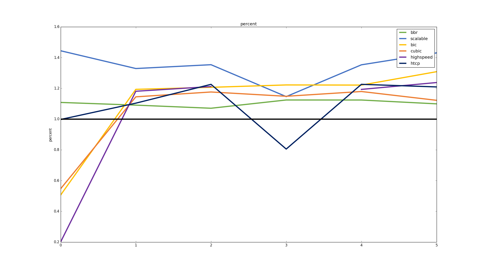
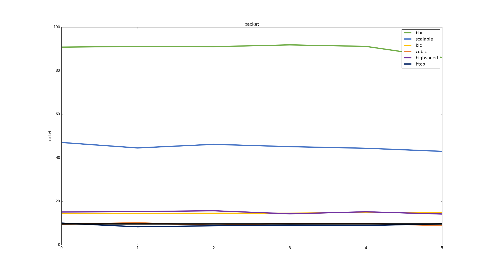

<h1 style="text-align: center"> Lab Report </h1>

 stormlin 2017-08-20 

<!-- TOC -->

- [1. Introduction](#1-introduction)
- [2. lan to dc1](#2-lan-to-dc1)
    - [2.1 Benchmark](#21-benchmark)
    - [2.2 Result for Test 0](#22-result-for-test-0)
    - [2.3 Result for Test 1](#23-result-for-test-1)
    - [2.4 Summary](#24-summary)
- [3. amazon to aliyun1](#3-amazon-to-aliyun1)
    - [3.1 Benchmark](#31-benchmark)
    - [3.2 Result for Test 0](#32-result-for-test-0)
    - [3.3 Result for Test 1](#33-result-for-test-1)
    - [3.4 Summary](#34-summary)
- [4. aliyun2 to dc2](#4-aliyun2-to-dc2)
    - [3.1 benchmark](#31-benchmark)
    - [3.2 Result for Test 0](#32-result-for-test-0-1)
    - [3.3 Rersult for Test 1](#33-rersult-for-test-1)
    - [4.4 Summary](#44-summary)
- [5. Conclusion](#5-conclusion)
- [6. Appendiex](#6-appendiex)
    - [Raw Result for Test 0 in "lan to dc1"](#raw-result-for-test-0-in-lan-to-dc1)
    - [Raw Result for Test 0 in "amazon to aliyun1"](#raw-result-for-test-0-in-amazon-to-aliyun1)
    - [Raw Result for Test 1 in "amazon to aliyun1"](#raw-result-for-test-1-in-amazon-to-aliyun1)
    - [Raw Result for Test 0 in "aliyun2 to dc2"](#raw-result-for-test-0-in-aliyun2-to-dc2)
    - [Raw Result for Test 1 in "aliyun2 to dc2"](#raw-result-for-test-1-in-aliyun2-to-dc2)

<!-- /TOC -->

# 1. Introduction

# 2. lan to dc1

## 2.1 Benchmark

测试时长: 24 hours.

开始时间: 2017-08-14 21:00

基准测试结果（原始结果共 86400s，下表取 10000s - 70000s）

||Max|Min|Median|Average|Var|
|-|--|---|------|-------|---|
|RTT(ms)|57.16|3.92|7.83|8.89|7.36|
|Bandwidth(Mbit/s)|100.01|70.00|90.00|89.55|4.28|
|Retransmission Packet|15.00|0.00|0.00|0.01|0.02|
|BDP(Mbit)|4213.96|318.46|702.45|796.46|59077.85|

结果图像（原始结果：0s - 86400s）：

> 结论：已完成，意外结果较多。故生成上表统计数据的时候采用 10000.0s - 70000.0s 之间网络较为稳定时的数据。基准测试结果采用 0s - 70000s 之间的各项之平均数。

## 2.2 Result for Test 0

Duration: 12 hours.

Start time: 2017-08-15 22:00

Duration: 6h

测试结果：
+   RTT
    
    
+   Bandwidth
    
    
+   Efficiency
    
    
+   Retransmits
    
    

## 2.3 Result for Test 1

Duration: 12 hours.

**Status: Suspended**

**现暂时无法取回**

## 2.4 Summary

+   RTT：

    综合六次测试结果，在延迟控制方面控制的最好的是 Vegas，其次到 BBR。

+   Bandwidth：

    在带宽的获取上，出 Vegas 外，其余算法均无较大差别。关于 Vegas 无法获取到足够的有效带宽的问题，参见相关文献资料。

+   Efficiency：

    同上，除 Vegas 外，其余算法表现良好。

+   Retransmits：

    在重传数据包数目上，由于本次测试处于内网中，丢包率较低，故各算法均无明显差异。

# 3. amazon to aliyun1

## 3.1 Benchmark

Duration: 24 hours.

Start time: 2017-08-15 19:10

基准测试结果

||Max|Min|Median|Average|Var|
|-|--|---|------|-------|---|
|RTT(ms)|927.26|230.08|236.56|259.96|3385.34|
|Bandwidth(Mbit/s)|100.02|0.00|40.00|40.59|323.41|
|Retransmission Packet|748.00|0.00|0.00|10.92|3243.44|
|BDP(Mbit)|27501.93|0.00|9470.35|10001.07|18770896.76|

结果图像（原始结果：0s - 86400s）：

> 结论：已完成。此链路为典型的跨国网络，高带宽、高延迟与高重传并存。

## 3.2 Result for Test 0

Duration: 12 hours.

Start time: 2017-08-16 21:52

**注意：在本次测试中缺少 Highspeed 在 round_3 时的测试结果，故结果图像表现为截断的曲线。**

测试结果：
+   RTT
    
    
+   Bandwidth
    
    
+   Efficiency
    
    
+   Retransmits
    
    

## 3.3 Result for Test 1

Duration: 12 hours.

Start time: 2017-08-18 23:02

测试结果：

+   RTT
    
    
+   Bandwidth
    
    
+   Efficiency
    
    
+   Retransmits
    
    

## 3.4 Summary

+   RTT：

    在 RTT 测试项目上，除 Test 0 和 Test 1 的 roun_1 外，各算法均能有效控制延迟。

+   Bandwidth：

    除 Vegas 和 Reno 外，其余算法均能取得比基准测试结果更大的带宽。同时，在 Test 1 的测试中出现了较大的测量误差，需要补充测试。

+   Efficiency：

    趋势同上。

+   Retransmits：

    BBR 的重传数目异常大，其原因有待分析。另外，Illinois 和 Yeah 的重传结果也相对较大。

# 4. aliyun2 to dc2

## 3.1 benchmark

Duration: 24 hours.

Start time: 2017-08-15 12:02

**Status: Finished**

基准测试结果（共 86400s）

||Max|Min|Average|Median|Var|
|-|--|---|------|-------|---|
|RTT(ms)|247.50|29.27|30.93|31.39|28.63|
|Bandwidth(Mbit/s)|3.50|0.00|1.33|1.03|0.11|
|Retransmission Packet|130.00|0.00|9.00|9.56|3.13|
|BDP(Mbit)|265.37|0.00|40.13|32.17|137.73|

结果图像（原始结果）：

> 结论：已完成，效果显著，而且意外结果较多。

## 3.2 Result for Test 0

Duration: 12 hours.

Start time: 2017-08-16 15:06

测试结果：

+   RTT
    
    
+   Bandwidth
    
    
+   Efficiency
    
    
+   Retransmits
    
    

## 3.3 Rersult for Test 1

Duration: 12 hours.

Start time: 2017-08-18 23:51

测试结果：

+   RTT
    
    
+   Bandwidth
    
    
+   Efficiency
    
    
+   Retransmits
    
    

## 4.4 Summary

+   RTT：

    在 RTT 测试项目上，由于本场景处于国内互联网，RTT 差异不大，故可认为各算法均能有效地控制 RTT。

+   Bandwidth：

    各算法均能有效利用带宽。

+   Efficiency：

    趋势同上。

+   Retransmits：

    BBR 的重传数目异常大，其原因有待分析。另外，Scalable 和 Yeah 的重传结果也相对较大。

# 5. Conclusion

+   局域网内综合表现最好的算法为 BBR。
+   而在国际互联网上。除了 Reno 和 Vegas，其余都是较好地控制延迟和带宽；另外，BBR、Illinois 和 Yeah 的高重传会对整个互联网环境造成什么影响，值得讨论。
+   结果同国际互联网。

# 6. Appendiex

## Raw Result for Test 0 in "lan to dc1"

### 1.2.1 round_0

||Algorithm|Max|Min|Average|Median|Var|
|-|--|---|------|-------|---|--|
|RTT(ms)|bbr|5.44|1.51|3.71|3.72|0.18|
||scalable|21.48|5.21|10.47|11.47|7.12|
||bic|14.55|5.02|9.02|8.08|6.46|
||cubic|14.20|4.21|7.77|7.14|4.18|
||highspeed|19.45|5.22|12.20|12.41|13.92|
||htcp|17.89|5.89|10.30|10.56|10.49|
||hybla|14.07|5.85|8.23|7.35|4.98|
||illinois|14.23|6.56|12.58|12.63|1.40|
||vegas|2.50|1.57|1.97|1.99|0.01|
||yeah|7.26|3.78|5.38|5.30|0.42|
||reno|18.87|3.97|9.95|8.43|18.83|
|Bandwidth(Mbit/s)|bbr|103.67|74.56|88.40|89.48|13.46|
||scalable|105.63|70.00|89.59|90.00|6.98|
||bic|102.15|89.48|89.61|89.48|0.96|
||cubic|95.45|83.51|89.60|89.48|6.10|
||highspeed|110.00|79.99|89.65|90.00|9.35|
||htcp|109.45|79.99|89.63|90.00|4.77|
||hybla|101.96|85.00|89.61|87.49|22.19|
||illinois|102.65|79.99|89.63|90.00|3.74|
||vegas|90.48|50.71|86.82|89.48|77.89|
||yeah|102.12|82.52|89.58|87.50|7.36|
||reno|104.60|79.99|89.64|90.00|4.90|
|Retransmission Packet	|bbr|2.00|0.00|0.01|0.00|0.02|
||scalable|4.00|0.00|0.01|0.00|0.04|
||bic|2.00|0.00|0.01|0.00|0.01|
||cubic|1.00|0.00|0.01|0.00|0.01|
||highspeed|2.00|0.00|0.01|0.00|0.01|
||htcp|2.00|0.00|0.01|0.00|0.01|
||hybla|1.00|0.00|0.00|0.00|0.00|
||illinois|0.00|0.00|0.00|0.00|0.00|
||vegas|1.00|0.00|0.01|0.00|0.00|
||yeah|1.00|0.00|0.01|0.00|0.01|
||reno|1.00|0.00|0.01|0.00|0.00|
|BDP(Kbit)|bbr|156.75|
||scalable|550.53|
||bic|513.09|
||cubic|401.76|
||highspeed|574.66|
||htcp|644.88|
||hybla|596.07|
||illinois|673.25|
||vegas|141.70|
||yeah|386.10|
||reno|415.26|

### 1.2.2 round_1

||Algorithm|Max|Min|Average|Median|Var|
|-|--|---|------|-------|---|--|
|RTT(ms)|bbr|4.38|1.51|3.66|3.69|0.14|
||scalable|14.60|5.26|10.08|10.86|7.62|
||bic|14.49|4.64|6.99|6.93|0.74|
||cubic|14.28|4.12|6.79|6.76|1.03|
||highspeed|7.39|3.98|5.38|5.25|0.40|
||htcp|10.17|4.30|6.53|6.60|0.65|
||hybla|7.01|3.69|5.18|5.11|0.27|
||illinois|7.60|3.67|5.68|5.66|0.63|
||vegas|2.36|1.49|1.90|1.92|0.02|
||yeah|7.44|3.88|5.49|5.38|0.55|
||reno|7.71|3.95|5.51|5.42|0.64|
|Bandwidth(Mbit/s)|bbr|104.12|74.57|88.38|89.98|15.89|
||scalable|113.20|79.99|89.62|90.00|4.92|
||bic|95.13|85.51|89.59|89.48|2.64|
||cubic|94.46|85.01|89.60|89.48|0.57|
||highspeed|93.86|87.00|89.58|89.48|0.33|
||htcp|92.54|86.99|89.60|90.48|2.61|
||hybla|91.48|87.49|89.58|89.48|0.20|
||illinois|92.47|84.51|89.58|89.48|0.33|
||vegas|89.98|51.70|76.74|88.49|239.06|
||yeah|92.39|85.51|89.58|89.48|0.25|
||reno|93.90|86.00|89.57|89.48|0.27|
|Retransmission Packet	|bbr|1.00|0.00|0.00|0.00|0.00|
||scalable|1.00|0.00|0.01|0.00|0.00|
||bic|1.00|0.00|0.00|0.00|0.00|
||cubic|1.00|0.00|0.01|0.00|0.01|
||highspeed|1.00|0.00|0.01|0.00|0.01|
||htcp|0.00|0.00|0.00|0.00|0.00|
||hybla|3.00|0.00|0.02|0.00|0.03|
||illinois|1.00|0.00|0.01|0.00|0.01|
||vegas|1.00|0.00|0.00|0.00|0.00|
||yeah|1.00|0.00|0.00|0.00|0.00|
||reno|1.00|0.00|0.01|0.00|0.00|
|BDP(Kbit)|bbr|157.32|
||scalable|594.98|
||bic|441.61|
||cubic|388.97|
||highspeed|373.20|
||htcp|398.29|
||hybla|337.73|
||illinois|338.98|
||vegas|134.07|
||yeah|358.31|
||reno|370.61|

### 1.2.3 round_2

||Algorithm|Max|Min|Average|Median|Var|
|-|--|---|------|-------|---|--|
|RTT(ms)|bbr|4.39|1.49|3.65|3.66|0.13|
||scalable|7.54|3.92|5.51|5.45|0.54|
||bic|34.86|3.90|6.54|6.52|2.40|
||cubic|14.47|4.41|11.19|12.36|8.10|
||highspeed|7.97|3.95|5.47|5.38|0.53|
||htcp|9.93|4.06|6.31|6.48|0.78|
||hybla|7.73|4.02|5.35|5.25|0.35|
||illinois|7.55|4.02|5.63|5.56|0.62|
||vegas|2.73|1.53|1.78|1.76|0.01|
||yeah|7.13|4.06|5.26|5.18|0.26|
||reno|7.53|3.98|5.63|5.61|0.61|
|Bandwidth(Mbit/s)|bbr|99.66|74.56|88.37|89.48|13.96|
||scalable|92.36|86.00|89.58|89.48|0.26|
||bic|95.45|78.54|89.43|89.48|2.56|
||cubic|117.41|79.99|89.65|90.00|5.01|
||highspeed|93.13|83.02|89.58|89.48|0.35|
||htcp|94.03|86.00|89.59|89.98|1.92|
||hybla|91.97|87.99|89.59|89.48|0.23|
||illinois|92.53|87.49|89.59|89.48|0.42|
||vegas|90.04|49.21|60.17|55.18|147.92|
||yeah|92.87|87.99|89.58|89.48|0.22|
||reno|92.41|87.00|89.59|89.48|0.57|
|Retransmission Packet	|bbr|1.00|0.00|0.00|0.00|0.00|
||scalable|0.00|0.00|0.00|0.00|0.00|
||bic|16.00|0.00|0.14|0.00|1.23|
||cubic|26.00|0.00|0.04|0.00|1.13|
||highspeed|1.00|0.00|0.00|0.00|0.00|
||htcp|1.00|0.00|0.00|0.00|0.00|
||hybla|1.00|0.00|0.00|0.00|0.00|
||illinois|0.00|0.00|0.00|0.00|0.00|
||vegas|1.00|0.00|0.01|0.00|0.00|
||yeah|1.00|0.00|0.01|0.00|0.01|
||reno|0.00|0.00|0.00|0.00|0.00|
|BDP(Kbit)|bbr|148.40|
||scalable|362.15|
||bic|372.17|
||cubic|517.78|
||highspeed|368.07|
||htcp|382.14|
||hybla|369.63|
||illinois|371.78|
||vegas|138.03|
||yeah|376.68|
||reno|367.87|

### 1.2.4 round_3

||Algorithm|Max|Min|Average|Median|Var|
|-|--|---|------|-------|---|--|
|RTT(ms)|bbr|4.26|1.48|3.65|3.69|0.15|
||scalable|7.48|3.92|5.53|5.45|0.59|
||bic|10.45|4.12|6.41|6.53|0.87|
||cubic|14.11|4.40|7.08|7.04|0.84|
||highspeed|7.62|3.95|5.69|5.64|0.63|
||htcp|8.63|3.90|6.31|6.40|0.81|
||hybla|7.35|3.95|5.25|5.15|0.27|
||illinois|7.66|4.01|5.74|5.74|0.68|
||vegas|2.10|1.52|1.76|1.75|0.01|
||yeah|7.84|4.00|5.48|5.39|0.50|
||reno|8.22|3.99|5.54|5.47|0.57|
|Bandwidth(Mbit/s)|bbr|100.31|74.57|88.38|89.48|14.35|
||scalable|92.86|88.99|89.59|89.48|0.23|
||bic|93.48|87.00|89.59|89.48|3.24|
||cubic|94.46|87.00|89.60|89.48|1.09|
||highspeed|92.87|84.02|89.57|89.48|0.59|
||htcp|93.46|87.00|89.60|89.48|2.37|
||hybla|92.36|87.99|89.59|89.48|0.21|
||illinois|92.47|87.49|89.59|89.48|0.24|
||vegas|89.98|48.72|58.01|55.68|83.30|
||yeah|92.89|82.52|89.58|89.48|0.33|
||reno|92.36|87.00|89.58|89.48|0.29|
|Retransmission Packet	|bbr|1.00|0.00|0.00|0.00|0.00|
||scalable|1.00|0.00|0.00|0.00|0.00|
||bic|1.00|0.00|0.00|0.00|0.00|
||cubic|1.00|0.00|0.00|0.00|0.00|
||highspeed|0.00|0.00|0.00|0.00|0.00|
||htcp|1.00|0.00|0.01|0.00|0.00|
||hybla|1.00|0.00|0.01|0.00|0.00|
||illinois|0.00|0.00|0.00|0.00|0.00|
||vegas|0.00|0.00|0.00|0.00|0.00|
||yeah|1.00|0.00|0.00|0.00|0.00|
||reno|1.00|0.00|0.00|0.00|0.00|
|BDP(Kbit)|bbr|148.67|
||scalable|363.64|
||bic|385.59|
||cubic|415.89|
||highspeed|366.84|
||htcp|364.78|
||hybla|364.74|
||illinois|370.88|
||vegas|136.68|
||yeah|371.20|
||reno|368.80|

### 1.2.5 round_4

||Algorithm|Max|Min|Average|Median|Var|
|-|--|---|------|-------|---|--|
|RTT(ms)|bbr|4.30|1.50|3.65|3.68|0.12|
||scalable|7.57|4.02|5.60|5.51|0.56|
||bic|7.57|3.86|5.62|5.55|0.71|
||cubic|14.52|4.20|9.20|8.59|10.65|
||highspeed|7.61|3.94|5.54|5.43|0.67|
||htcp|9.26|4.02|6.32|6.39|0.95|
||hybla|7.17|4.14|5.29|5.19|0.29|
||illinois|8.70|4.10|5.82|5.77|0.74|
||vegas|4.37|1.53|1.88|1.90|0.04|
||yeah|7.70|3.96|5.32|5.20|0.36|
||reno|8.15|3.94|5.48|5.43|0.52|
|Bandwidth(Mbit/s)|bbr|103.74|74.57|88.40|89.48|12.99|
||scalable|93.46|87.00|89.58|89.48|0.43|
||bic|93.86|87.00|89.59|89.48|0.32|
||cubic|101.59|80.00|89.62|89.48|1.88|
||highspeed|92.86|87.00|89.58|89.48|0.28|
||htcp|93.96|85.51|89.59|89.48|0.89|
||hybla|91.97|87.49|89.58|89.48|0.24|
||illinois|93.34|85.01|89.58|89.48|0.32|
||vegas|90.48|50.71|73.46|88.49|304.20|
||yeah|92.39|87.99|89.59|89.48|0.23|
||reno|93.32|84.51|89.58|89.48|0.29|
|Retransmission Packet	|bbr|1.00|0.00|0.01|0.00|0.00|
||scalable|0.00|0.00|0.00|0.00|0.00|
||bic|1.00|0.00|0.00|0.00|0.00|
||cubic|1.00|0.00|0.01|0.00|0.01|
||highspeed|1.00|0.00|0.00|0.00|0.00|
||htcp|1.00|0.00|0.01|0.00|0.01|
||hybla|1.00|0.00|0.00|0.00|0.00|
||illinois|0.00|0.00|0.00|0.00|0.00|
||vegas|1.00|0.00|0.00|0.00|0.00|
||yeah|1.00|0.00|0.01|0.00|0.00|
||reno|1.00|0.00|0.00|0.00|0.00|
|BDP(Kbit)|bbr|155.82|
||scalable|375.50|
||bic|362.41|
||cubic|426.27|
||highspeed|365.40|
||htcp|377.90|
||hybla|380.48|
||illinois|382.90|
||vegas|138.70|
||yeah|365.42|
||reno|367.22|

### 1.2.6 round_5

||Algorithm|Max|Min|Average|Median|Var|
|-|--|---|------|-------|---|--|
|RTT(ms)|bbr|4.43|1.50|3.66|3.68|0.13|
||scalable|7.75|3.95|5.53|5.47|0.58|
||bic|9.80|4.12|6.03|6.02|0.74|
||cubic|14.64|4.06|9.44|9.00|8.57|
||highspeed|7.53|3.59|5.41|5.27|0.50|
||htcp|14.58|4.22|6.98|6.65|3.30|
||hybla|7.62|3.78|5.31|5.17|0.35|
||illinois|7.81|3.95|5.67|5.64|0.61|
||vegas|3.55|1.51|1.78|1.77|0.02|
||yeah|7.43|3.92|5.38|5.27|0.41|
||reno|7.52|3.88|5.58|5.50|0.60|
|Bandwidth(Mbit/s)|bbr|99.94|74.57|88.38|89.48|13.35|
||scalable|92.63|85.01|89.58|89.48|0.30|
||bic|96.63|86.99|89.57|90.48|2.20|
||cubic|96.44|84.51|89.61|89.48|13.53|
||highspeed|92.14|87.49|89.58|89.48|0.29|
||htcp|95.45|87.00|89.60|89.48|0.84|
||hybla|92.12|87.50|89.58|89.48|0.25|
||illinois|93.37|87.49|89.59|89.48|0.28|
||vegas|89.98|49.22|58.85|54.69|126.37|
||yeah|92.87|87.00|89.59|89.48|0.25|
||reno|93.82|87.49|89.58|89.48|0.26|
|Retransmission Packet	|bbr|1.00|0.00|0.00|0.00|0.00|
||scalable|1.00|0.00|0.00|0.00|0.00|
||bic|1.00|0.00|0.00|0.00|0.00|
||cubic|0.00|0.00|0.00|0.00|0.00|
||highspeed|1.00|0.00|0.01|0.00|0.00|
||htcp|1.00|0.00|0.01|0.00|0.00|
||hybla|1.00|0.00|0.00|0.00|0.00|
||illinois|1.00|0.00|0.00|0.00|0.00|
||vegas|1.00|0.00|0.00|0.00|0.00|
||yeah|1.00|0.00|0.00|0.00|0.00|
||reno|1.00|0.00|0.00|0.00|0.00|
|BDP(Kbit)|bbr|149.81|
||scalable|366.06|
||bic|398.19|
||cubic|391.36|
||highspeed|330.51|
||htcp|402.81|
||hybla|347.93|
||illinois|369.17|
||vegas|136.32|
||yeah|363.77|
||reno|364.21|

## Raw Result for Test 0 in "amazon to aliyun1"

### 2.2.1 round_0

||Algorithm|Max|Min|Average|Median|Var|
|-|--|---|------|-------|---|--|
|RTT(ms)|bbr|241.82|232.00|235.71|235.94|2.20|
||scalable|246.64|235.31|237.09|236.69|1.75|
||bic|244.96|235.34|236.73|236.59|0.92|
||cubic|237.78|231.10|232.08|231.83|0.72|
||highspeed|245.74|233.88|237.65|237.07|1.88|
||htcp|436.22|224.54|228.45|227.44|82.18|
||hybla|246.55|236.46|237.84|237.44|1.57|
||illinois|471.61|230.52|241.49|236.13|274.55|
||vegas|407.99|234.60|254.24|242.31|514.41|
||yeah|274.23|235.34|249.16|249.47|67.51|
||reno|274.27|236.00|248.75|248.96|46.60|
|Bandwidth(Mbit/s)|bbr|70.03|7.25|44.98|50.00|92.51|
||scalable|90.02|6.01|58.61|60.00|159.76|
||bic|60.00|0.00|20.54|20.00|115.65|
||cubic|80.00|0.00|22.20|20.00|152.50|
||highspeed|40.01|0.00|8.16|10.00|40.33|
||htcp|100.01|0.00|40.48|40.00|287.77|
||hybla|90.02|10.00|54.97|50.01|247.99|
||illinois|100.02|6.26|58.05|60.00|179.25|
||vegas|60.01|0.00|19.78|14.92|224.02|
||yeah|90.02|4.56|49.62|50.00|186.44|
||reno|1.17|0.00|0.20|0.00|0.06|
|Retransmission Packet	|bbr|1819.00|0.00|816.29|807.50|75587.80|
||scalable|981.00|0.00|14.76|0.00|7855.15|
||bic|345.00|0.00|1.10|0.00|237.27|
||cubic|423.00|0.00|1.55|0.00|517.45|
||highspeed|319.00|0.00|0.59|0.00|169.34|
||htcp|643.00|0.00|14.03|0.00|4452.71|
||hybla|476.00|0.00|4.45|0.00|768.99|
||illinois|808.00|0.00|24.23|0.00|8162.03|
||vegas|5.00|0.00|0.01|0.00|0.04|
||yeah|836.00|0.00|20.86|0.00|9350.52|
||reno|4.00|0.00|1.04|1.00|0.76|
|BDP(Kbit)|bbr|16246.94|
||scalable|21184.01|
||bic|14120.36|
||cubic|18487.93|
||highspeed|9357.00|
||htcp|22456.71|
||hybla|21285.17|
||illinois|23056.18|
||vegas|14079.15|
||yeah|21184.41|
||reno|276.31|

### 2.2.2 round_1

||Algorithm|Max|Min|Average|Median|Var|
|-|--|---|------|-------|---|--|
|RTT(ms)|bbr|276.42|232.10|252.96|254.10|56.50|
||scalable|283.79|234.90|256.31|256.89|96.44|
||bic|286.14|232.68|257.76|256.45|110.50|
||cubic|278.13|229.13|256.27|256.73|52.35|
||highspeed|284.10|235.88|263.04|263.25|57.86|
||htcp|291.56|237.97|266.21|266.46|65.64|
||hybla|288.58|235.74|260.58|260.52|60.44|
||illinois|296.86|242.87|274.27|274.45|71.08|
||vegas|286.42|245.98|269.68|269.97|40.40|
||yeah|276.83|233.79|259.73|259.81|38.61|
||reno|274.05|230.99|255.95|256.52|51.89|
|Bandwidth(Mbit/s)|bbr|70.07|0.00|44.26|49.99|95.45|
||scalable|90.02|2.45|53.93|50.00|130.54|
||bic|80.01|2.15|48.43|49.99|160.10|
||cubic|80.02|2.30|46.45|40.01|140.91|
||highspeed|80.01|2.00|47.92|40.01|190.41|
||htcp|80.01|2.22|44.79|40.01|214.39|
||hybla|90.02|0.00|52.18|50.00|227.05|
||illinois|80.02|2.30|50.20|50.00|125.70|
||vegas|32.46|0.00|5.73|0.00|69.35|
||yeah|60.02|2.12|34.02|30.00|73.17|
||reno|60.01|0.00|32.00|30.00|140.84|
|Retransmission Packet	|bbr|1660.00|0.00|685.98|683.50|73396.60|
||scalable|842.00|0.00|8.94|0.00|3290.96|
||bic|548.00|0.00|15.61|0.00|4840.18|
||cubic|625.00|0.00|10.25|0.00|2931.57|
||highspeed|354.00|0.00|2.12|0.00|575.97|
||htcp|602.00|0.00|23.44|0.00|6235.56|
||hybla|268.00|0.00|3.10|0.00|348.36|
||illinois|425.00|0.00|1.51|0.00|427.98|
||vegas|0.00|0.00|0.00|0.00|0.00|
||yeah|285.00|0.00|1.42|0.00|264.92|
||reno|472.00|0.00|1.33|0.00|476.76|
|BDP(Kbit)|bbr|16262.73|
||scalable|21145.23|
||bic|18616.63|
||cubic|18334.29|
||highspeed|18873.51|
||htcp|19040.49|
||hybla|21220.66|
||illinois|19433.13|
||vegas|7985.30|
||yeah|14032.24|
||reno|13862.02|

### 2.2.3 round_2

||Algorithm|Max|Min|Average|Median|Var|
|-|--|---|------|-------|---|--|
|RTT(ms)|bbr|286.78|243.93|262.83|263.14|58.76|
||scalable|265.42|243.87|248.79|248.07|20.93|
||bic|292.06|247.53|255.46|253.50|28.41|
||cubic|254.59|236.00|243.59|244.56|8.46|
||highspeed|253.50|245.09|247.25|247.09|0.50|
||htcp|251.82|241.73|244.11|243.76|1.29|
||hybla|258.55|242.75|247.80|247.43|1.74|
||illinois|245.42|230.15|234.82|236.10|6.49|
||vegas|254.82|240.05|245.76|244.98|3.49|
||yeah|252.91|244.08|246.00|245.58|1.52|
||reno|254.25|244.19|247.22|246.71|1.61|
|Bandwidth(Mbit/s)|bbr|80.03|3.43|43.44|40.00|89.77|
||scalable|90.00|4.32|54.93|50.00|125.14|
||bic|80.01|2.30|48.97|50.00|142.10|
||cubic|80.02|0.00|47.73|50.00|185.96|
||highspeed|80.01|5.66|49.17|50.00|222.03|
||htcp|90.00|5.83|49.75|50.00|221.87|
||hybla|90.02|10.00|53.88|50.00|245.72|
||illinois|90.02|6.26|57.55|60.00|125.50|
||vegas|50.01|4.34|16.65|10.00|106.27|
||yeah|90.02|4.64|55.07|50.01|155.26|
||reno|70.01|4.68|38.61|40.00|118.08|
|Retransmission Packet	|bbr|1482.00|0.00|639.84|619.00|68137.62|
||scalable|753.00|0.00|11.18|0.00|4062.09|
||bic|637.00|0.00|15.14|0.00|5013.19|
||cubic|678.00|0.00|18.57|0.00|6410.24|
||highspeed|329.00|0.00|0.93|0.00|198.85|
||htcp|733.00|0.00|36.15|0.00|11781.54|
||hybla|191.00|0.00|3.29|0.00|280.44|
||illinois|817.00|0.00|13.38|0.00|4360.82|
||vegas|564.00|0.00|1.21|0.00|550.85|
||yeah|882.00|0.00|33.93|0.00|11989.43|
||reno|306.00|0.00|0.98|0.00|251.87|
|BDP(Kbit)|bbr|19522.38|
||scalable|21948.76|
||bic|19805.03|
||cubic|18884.23|
||highspeed|19609.47|
||htcp|21756.45|
||hybla|21851.91|
||illinois|20717.26|
||vegas|12005.03|
||yeah|21971.70|
||reno|17096.28|

### 2.2.4 round_3

**缺少 highspeed 的测试结果。highspeed 的实验意外终止。**

||Algorithm|Max|Min|Average|Median|Var|
|-|--|---|------|-------|---|--|
|RTT(ms)|bbr|253.48|240.01|243.46|243.78|2.52|
||scalable|251.23|236.36|239.52|239.15|1.88|
||bic|247.26|234.73|240.51|240.37|2.09|
||cubic|251.43|241.55|244.25|243.73|1.84|
||htcp|252.62|243.92|244.96|244.36|2.18|
||hybla|248.88|240.01|241.76|241.41|1.29|
||illinois|246.77|236.00|238.54|236.97|5.72|
||vegas|242.44|233.87|234.34|234.01|1.14|
||yeah|302.22|244.01|245.67|245.28|6.53|
||reno|250.82|242.18|242.83|242.43|1.52|
|Bandwidth(Mbit/s)|bbr|70.02|0.00|45.62|50.00|86.97|
||scalable|90.01|0.00|46.52|50.00|599.42|
||bic|90.02|0.00|49.59|50.00|199.44|
||cubic|90.02|5.94|46.60|49.95|147.42|
||htcp|90.02|0.00|32.67|40.00|600.99|
||hybla|100.02|0.00|54.60|50.01|244.82|
||illinois|90.02|4.38|57.67|60.00|147.89|
||vegas|80.01|4.31|44.31|40.01|143.61|
||yeah|90.02|4.40|57.02|60.00|146.55|
||reno|80.01|4.40|45.65|50.00|233.52|
|Retransmission Packet	|bbr|1807.00|0.00|748.60|745.00|67783.94|
||scalable|737.00|0.00|11.78|0.00|5140.44|
||bic|803.00|0.00|17.77|0.00|6424.96|
||cubic|718.00|0.00|14.09|0.00|4366.92|
||htcp|800.00|0.00|22.64|0.00|7755.28|
||hybla|373.00|0.00|4.31|0.00|652.83|
||illinois|912.00|0.00|26.15|0.00|11935.83|
||vegas|318.00|0.00|0.85|0.00|207.64|
||yeah|1003.00|0.00|44.87|0.00|19336.86|
||reno|594.00|0.00|1.44|0.00|633.86|
|BDP(Kbit)|bbr|16804.79|
||scalable|21275.75|
||bic|21130.32|
||cubic|21743.64|
||htcp|21957.82|
||hybla|24006.09|
||illinois|21244.29|
||vegas|18712.98|
||yeah|21965.27|
||reno|19375.92|

### 2.2.5 round_4

||Algorithm|Max|Min|Average|Median|Var|
|-|--|---|------|-------|---|--|
|RTT(ms)|bbr|254.18|244.00|246.43|246.55|2.35|
||scalable|253.60|241.78|247.04|246.90|1.77|
||bic|250.36|238.49|242.40|242.70|3.90|
||cubic|253.91|244.70|247.48|247.12|1.38|
||highspeed|247.83|237.23|238.70|238.22|1.58|
||htcp|239.23|232.09|234.02|233.63|1.58|
||hybla|270.88|243.81|244.37|243.95|2.47|
||illinois|246.89|236.10|238.07|237.60|1.92|
||vegas|256.73|246.68|247.76|247.46|1.43|
||yeah|255.57|246.55|248.18|247.87|1.14|
||reno|242.49|233.74|236.32|236.17|0.97|
|Bandwidth(Mbit/s)|bbr|70.02|8.14|45.61|50.00|77.27|
||scalable|90.01|4.40|54.90|50.00|128.39|
||bic|90.02|4.35|49.55|50.00|160.36|
||cubic|80.02|5.39|47.86|50.00|168.70|
||highspeed|80.02|5.89|48.42|50.00|122.35|
||htcp|100.02|4.89|49.76|50.00|245.45|
||hybla|90.02|10.00|51.79|50.00|213.89|
||illinois|100.02|4.40|59.12|60.00|178.00|
||vegas|50.01|5.39|33.18|30.00|72.10|
||yeah|80.01|4.40|54.43|50.00|122.43|
||reno|70.01|4.40|43.91|40.01|115.96|
|Retransmission Packet	|bbr|1758.00|0.00|726.33|727.00|73487.71|
||scalable|657.00|0.00|9.29|0.00|3104.90|
||bic|841.00|0.00|18.14|0.00|7801.91|
||cubic|560.00|0.00|15.55|0.00|4443.72|
||highspeed|261.00|0.00|1.43|0.00|236.66|
||htcp|809.00|0.00|41.72|0.00|15920.70|
||hybla|440.00|0.00|4.44|0.00|718.17|
||illinois|861.00|0.00|30.45|0.00|12820.35|
||vegas|573.00|0.00|1.16|0.00|561.60|
||yeah|809.00|0.00|33.59|0.00|11711.30|
||reno|501.00|0.00|1.71|0.00|751.23|
|BDP(Kbit)|bbr|17084.97|
||scalable|21763.21|
||bic|21467.62|
||cubic|19580.42|
||highspeed|18982.04|
||htcp|23212.75|
||hybla|21946.73|
||illinois|23615.12|
||vegas|12336.95|
||yeah|19725.85|
||reno|16364.81|

### 2.2.6 round_5

||Algorithm|Max|Min|Average|Median|Var|
|-|--|---|------|-------|---|--|
|RTT(ms)|bbr|275.73|244.04|247.40|247.70|3.42|
||scalable|274.34|232.78|234.92|233.93|10.25|
||bic|282.99|228.83|229.92|229.23|6.93|
||cubic|247.04|236.53|239.36|238.93|1.60|
||highspeed|244.42|235.85|237.00|236.75|0.85|
||htcp|241.89|230.75|232.75|232.38|1.53|
||hybla|235.63|227.75|228.32|228.00|1.20|
||illinois|237.16|228.60|231.68|231.49|0.78|
||vegas|242.40|234.37|235.11|234.67|1.45|
||yeah|237.75|231.99|232.44|232.18|0.89|
||reno|246.94|241.50|241.80|241.62|0.56|
|Bandwidth(Mbit/s)|bbr|70.02|0.00|44.60|49.99|83.89|
||scalable|100.02|4.33|58.06|60.00|163.71|
||bic|100.01|4.37|53.09|50.00|198.25|
||cubic|90.02|4.40|45.54|40.01|160.16|
||highspeed|80.01|4.89|50.23|50.00|153.62|
||htcp|90.01|5.39|49.07|50.00|251.14|
||hybla|100.02|10.00|56.82|59.99|316.28|
||illinois|100.02|4.40|60.22|60.00|211.52|
||vegas|80.01|4.40|41.01|40.00|130.15|
||yeah|100.02|4.35|58.29|60.00|185.33|
||reno|80.01|4.29|43.71|40.00|202.10|
|Retransmission Packet	|bbr|1749.00|0.00|736.72|733.50|66935.15|
||scalable|696.00|0.00|13.58|0.00|5790.46|
||bic|700.00|0.00|14.70|0.00|5598.69|
||cubic|723.00|0.00|18.19|0.00|6528.99|
||highspeed|239.00|0.00|0.98|0.00|136.58|
||htcp|845.00|0.00|34.81|0.00|12119.82|
||hybla|217.00|0.00|4.44|0.00|531.13|
||illinois|929.00|0.00|33.81|0.00|15018.04|
||vegas|362.00|0.00|0.93|0.00|244.29|
||yeah|845.00|0.00|42.07|0.00|16251.44|
||reno|64.00|0.00|0.39|0.00|20.06|
|BDP(Kbit)|bbr|17087.01|
||scalable|23282.20|
||bic|22885.94|
||cubic|21292.07|
||highspeed|18871.68|
||htcp|20770.86|
||hybla|22778.55|
||illinois|22864.27|
||vegas|18753.35|
||yeah|23202.03|
||reno|19322.48|

## Raw Result for Test 1 in "amazon to aliyun1"

### 2.3.1 round_0

||Algorithm|Max|Min|Median|Average|Var|
|-|--|---|------|-------|---|--|
|RTT(ms)|bbr|254.20|236.00|238.26|238.29|2.53|
||scalable|259.53|241.03|244.06|242.69|7.93|
||bic|263.04|236.53|246.28|245.85|39.66|
||cubic|278.15|240.59|252.82|252.81|60.71|
||highspeed|268.99|231.34|253.61|254.27|36.94|
||htcp|284.54|245.01|268.46|268.82|40.19|
||hybla|279.67|241.14|262.13|262.61|37.65|
||illinois|283.00|246.12|268.94|269.09|34.21|
||vegas|297.97|252.93|276.30|276.63|38.19|
||yeah|295.55|246.29|270.07|269.81|63.11|
||reno|314.20|261.00|288.44|288.17|74.36|
|Bandwidth(Mbit/s)|bbr|60.03|6.89|45.71|50.00|90.42|
||scalable|90.01|3.84|54.24|50.00|131.50|
||bic|90.01|4.89|48.78|50.00|185.73|
||cubic|80.02|5.83|43.52|40.00|134.47|
||highspeed|70.00|2.94|42.58|40.00|77.22|
||htcp|80.01|2.52|43.27|40.00|188.10|
||hybla|80.01|0.00|50.97|50.00|204.06|
||illinois|80.02|2.30|49.88|50.00|120.71|
||vegas|40.03|0.00|7.25|0.00|102.44|
||yeah|70.01|2.47|30.21|30.00|137.96|
||reno|60.01|2.03|35.31|30.01|73.32|
|Retransmission Packet	|bbr|1670.00|0.00|793.20|775.50|81623.33|
||scalable|630.00|0.00|9.29|0.00|3406.88|
||bic|677.00|0.00|17.78|0.00|7056.69|
||cubic|545.00|0.00|15.21|0.00|4357.31|
||highspeed|485.00|0.00|1.15|0.00|415.59|
||htcp|580.00|0.00|17.31|0.00|3488.84|
||hybla|294.00|0.00|3.56|0.00|498.14|
||illinois|533.00|0.00|1.79|0.00|707.04|
||vegas|606.00|0.00|1.01|0.00|611.04|
||yeah|262.00|0.00|0.75|0.00|134.97|
||reno|198.00|0.00|0.42|0.00|68.92|
|BDP(Kbit)|bbr|14166.59|
||scalable|21696.08|
||bic|21289.06|
||cubic|19251.44|
||highspeed|16194.23|
||htcp|19603.88|
||hybla|19293.90|
||illinois|19693.97|
||vegas|10123.96|
||yeah|17243.24|
||reno|15662.47|

### 2.3.2 round_1

||Algorithm|Max|Min|Median|Average|Var|
|-|--|---|------|-------|---|--|
|RTT(ms)|bbr|316.34|267.83|293.76|292.72|111.89|
||scalable|339.05|273.62|309.09|308.15|151.78|
||bic|346.20|284.94|323.09|324.28|116.05|
||cubic|329.55|267.75|300.03|299.86|157.15|
||highspeed|325.40|265.08|296.28|296.97|60.09|
||htcp|295.85|251.19|276.58|276.80|45.20|
||hybla|288.28|245.07|270.21|270.51|35.32|
||illinois|271.15|237.35|250.14|250.08|57.38|
||vegas|261.67|240.53|245.39|244.53|20.08|
||yeah|245.37|233.30|235.98|235.44|2.05|
||reno|251.05|242.74|243.78|243.55|0.64|
|Bandwidth(Mbit/s)|bbr|60.03|0.00|38.24|40.00|87.74|
||scalable|80.02|1.99|45.99|40.01|92.79|
||bic|70.02|2.65|41.59|40.00|89.67|
||cubic|80.02|2.78|41.59|40.00|144.05|
||highspeed|80.02|2.52|45.23|45.00|154.92|
||htcp|80.01|2.74|42.37|40.00|181.77|
||hybla|80.02|0.00|49.64|50.00|220.54|
||illinois|100.02|2.30|52.57|50.00|134.88|
||vegas|40.02|0.00|21.13|20.00|76.87|
||yeah|100.02|4.34|55.79|50.01|221.53|
||reno|80.01|6.05|42.75|40.00|200.33|
|Retransmission Packet	|bbr|1256.00|0.00|567.17|559.00|56340.02|
||scalable|650.00|0.00|9.09|0.00|3131.00|
||bic|436.00|0.00|9.08|0.00|2416.57|
||cubic|513.00|0.00|15.32|0.00|3768.34|
||highspeed|123.00|0.00|0.49|0.00|35.52|
||htcp|609.00|0.00|18.64|0.00|4997.23|
||hybla|122.00|0.00|2.78|0.00|199.11|
||illinois|537.00|0.00|6.45|0.00|1794.46|
||vegas|0.00|0.00|0.00|0.00|0.00|
||yeah|1053.00|0.00|43.83|0.00|18255.62|
||reno|108.00|0.00|0.56|0.00|48.68|
|BDP(Kbit)|bbr|16078.24|
||scalable|21893.97|
||bic|19952.92|
||cubic|21425.05|
||highspeed|21211.22|
||htcp|20097.92|
||hybla|19609.46|
||illinois|23739.84|
||vegas|9625.77|
||yeah|23333.94|
||reno|19422.20|

### 2.3.3 round_2

||Algorithm|Max|Min|Median|Average|Var|
|-|--|---|------|-------|---|--|
|RTT(ms)|bbr|243.80|232.00|234.84|235.03|2.28|
||scalable|242.79|233.60|234.76|234.47|1.09|
||bic|248.55|239.11|239.84|239.40|1.75|
||cubic|248.76|240.60|241.54|241.20|0.97|
||highspeed|247.50|238.56|239.21|238.87|1.03|
||htcp|250.99|237.56|239.65|239.31|1.45|
||hybla|247.79|240.07|242.05|241.75|0.77|
||illinois|242.94|236.06|237.85|237.57|0.90|
||vegas|246.88|238.95|239.40|239.09|1.20|
||yeah|243.72|236.01|237.27|236.97|1.11|
||reno|247.69|237.47|241.35|241.14|0.70|
|Bandwidth(Mbit/s)|bbr|70.02|8.37|47.58|50.00|85.29|
||scalable|100.02|4.34|58.20|60.00|148.70|
||bic|90.01|5.83|51.65|50.00|188.56|
||cubic|90.02|4.36|31.51|30.00|270.02|
||highspeed|80.02|5.34|43.98|40.00|100.17|
||htcp|90.02|4.56|49.12|50.00|239.16|
||hybla|90.01|19.99|51.03|50.00|204.25|
||illinois|90.02|4.31|58.08|60.00|165.87|
||vegas|80.01|4.67|42.86|40.00|127.47|
||yeah|90.02|4.18|57.97|60.00|143.26|
||reno|60.01|4.67|36.74|40.00|93.21|
|Retransmission Packet	|bbr|1770.00|0.00|761.76|772.50|67444.57|
||scalable|805.00|0.00|9.76|0.00|3624.99|
||bic|773.00|0.00|15.52|0.00|6044.93|
||cubic|594.00|0.00|8.77|0.00|2770.57|
||highspeed|231.00|0.00|0.91|0.00|119.62|
||htcp|796.00|0.00|40.17|0.00|15927.49|
||hybla|285.00|0.00|3.54|0.00|387.37|
||illinois|808.00|0.00|29.69|0.00|12207.48|
||vegas|219.00|0.00|0.69|0.00|107.73|
||yeah|759.00|0.00|39.33|0.00|14422.29|
||reno|491.00|0.00|1.39|0.00|494.58|
|BDP(Kbit)|bbr|16244.86|
||scalable|23363.47|
||bic|21522.76|
||cubic|21657.68|
||highspeed|19089.52|
||htcp|21384.50|
||hybla|21609.43|
||illinois|21249.49|
||vegas|19119.24|
||yeah|21245.53|
||reno|14250.92|

### 2.3.4 round_3

||Algorithm|Max|Min|Median|Average|Var|
|-|--|---|------|-------|---|--|
|RTT(ms)|bbr|245.66|232.00|234.42|234.41|2.54|
||scalable|252.31|236.63|238.69|237.68|5.75|
||bic|253.40|244.03|245.06|244.66|1.59|
||cubic|239.16|232.00|234.01|233.70|1.13|
||highspeed|253.15|243.18|243.87|243.41|1.45|
||htcp|248.54|240.00|241.34|241.03|1.32|
||hybla|249.63|242.85|243.80|243.45|1.16|
||illinois|245.92|236.00|236.76|236.39|1.42|
||vegas|250.77|240.60|241.30|240.84|1.94|
||yeah|234.93|228.01|229.22|228.86|1.25|
||reno|240.05|233.10|233.51|233.21|0.97|
|Bandwidth(Mbit/s)|bbr|70.03|6.36|47.83|50.00|74.29|
||scalable|2.48|0.00|0.79|0.99|0.22|
||bic|90.00|4.62|47.65|40.01|162.11|
||cubic|90.02|4.62|48.39|49.99|185.66|
||highspeed|80.02|6.01|45.38|40.01|100.23|
||htcp|90.02|4.42|47.76|50.00|228.18|
||hybla|90.02|10.00|50.10|50.00|217.26|
||illinois|100.02|4.18|57.75|60.00|170.82|
||vegas|80.02|4.18|41.67|40.00|184.44|
||yeah|100.02|5.49|60.90|60.00|199.06|
||reno|70.01|5.17|40.25|40.00|125.95|
|Retransmission Packet	|bbr|1624.00|0.00|746.85|748.50|70110.12|
||scalable|6.00|0.00|0.91|1.00|0.92|
||bic|795.00|0.00|19.01|0.00|7991.62|
||cubic|656.00|0.00|15.30|0.00|5112.20|
||highspeed|275.00|0.00|0.96|0.00|161.97|
||htcp|758.00|0.00|27.34|0.00|8783.71|
||hybla|211.00|0.00|3.46|0.00|322.21|
||illinois|897.00|0.00|28.71|0.00|10230.96|
||vegas|179.00|0.00|0.58|0.00|64.24|
||yeah|940.00|0.00|43.83|0.00|18837.99|
||reno|172.00|0.00|0.51|0.00|58.62|
|BDP(Kbit)|bbr|16246.40|
||scalable|587.92|
||bic|21962.16|
||cubic|20884.13|
||highspeed|19459.42|
||htcp|21603.89|
||hybla|21861.84|
||illinois|23604.06|
||vegas|19251.48|
||yeah|22804.60|
||reno|16320.22|

### 2.3.5 round_4

||Algorithm|Max|Min|Median|Average|Var|
|-|--|---|------|-------|---|--|
|RTT(ms)|bbr|259.63|240.00|243.43|243.68|3.43|
||scalable|238.73|228.20|230.55|230.29|1.00|
||bic|244.77|233.55|235.31|234.98|1.28|
||cubic|250.79|242.71|243.79|243.46|1.08|
||highspeed|256.21|234.43|236.82|235.39|9.02|
||htcp|249.29|236.06|238.05|237.57|2.10|
||hybla|256.05|238.98|245.36|245.37|2.22|
||illinois|246.91|237.19|239.98|239.73|0.91|
||vegas|245.65|240.17|240.62|240.32|0.97|
||yeah|244.48|236.01|237.93|237.53|1.58|
||reno|248.44|236.73|240.17|240.02|2.05|
|Bandwidth(Mbit/s)|bbr|60.05|9.36|45.31|50.00|79.31|
||scalable|100.02|6.02|58.77|60.00|157.19|
||bic|100.01|4.61|51.34|50.00|174.62|
||cubic|90.02|4.09|50.66|50.00|150.12|
||highspeed|1.41|0.00|0.28|0.00|0.20|
||htcp|90.02|4.62|48.52|50.00|254.40|
||hybla|90.02|10.00|53.62|50.00|235.34|
||illinois|90.02|4.58|57.22|60.00|136.09|
||vegas|80.01|5.49|44.29|40.01|138.78|
||yeah|100.02|6.07|56.19|50.01|148.82|
||reno|80.01|4.18|46.32|49.99|196.75|
|Retransmission Packet	|bbr|1452.00|0.00|747.89|740.50|62911.11|
||scalable|801.00|0.00|11.15|0.00|4723.84|
||bic|735.00|0.00|18.58|0.00|8235.22|
||cubic|646.00|0.00|14.56|0.00|4985.63|
||highspeed|4.00|0.00|0.68|1.00|0.64|
||htcp|802.00|0.00|25.89|0.00|8016.17|
||hybla|234.00|0.00|4.14|0.00|487.88|
||illinois|951.00|0.00|24.96|0.00|9558.50|
||vegas|591.00|0.00|1.09|0.00|583.20|
||yeah|964.00|0.00|37.32|0.00|14792.15|
||reno|452.00|0.00|0.97|0.00|352.10|
|BDP(Kbit)|bbr|14412.95|
||scalable|22824.05|
||bic|23358.07|
||cubic|21848.70|
||highspeed|331.20|
||htcp|21249.74|
||hybla|21512.88|
||illinois|21351.63|
||vegas|19215.73|
||yeah|23605.29|
||reno|18940.94|

### 2.3.6 round_5

||Algorithm|Max|Min|Median|Average|Var|
|-|--|---|------|-------|---|--|
|RTT(ms)|bbr|247.97|240.00|241.69|241.58|1.70|
||scalable|253.22|237.43|240.57|240.65|2.40|
||bic|244.00|232.83|234.92|234.35|2.41|
||cubic|255.01|244.00|245.63|245.19|1.47|
||highspeed|249.30|239.50|239.99|239.61|1.36|
||htcp|240.47|232.09|234.17|233.82|1.42|
||hybla|246.03|240.38|240.88|240.59|0.98|
||illinois|255.30|240.30|242.99|242.43|1.94|
||vegas|246.60|240.39|241.46|241.16|0.98|
||yeah|250.28|236.92|239.53|239.18|1.52|
||reno|243.20|237.85|238.23|238.06|0.55|
|Bandwidth(Mbit/s)|bbr|60.04|6.37|45.38|50.00|80.14|
||scalable|90.02|0.00|43.28|50.00|662.91|
||bic|100.02|4.18|52.32|50.00|180.53|
||cubic|80.01|6.12|45.20|40.01|133.94|
||highspeed|80.02|4.65|44.68|40.01|117.51|
||htcp|100.02|4.62|49.22|50.00|257.98|
||hybla|90.02|10.00|52.62|50.00|232.24|
||illinois|90.02|4.52|56.07|55.00|151.81|
||vegas|40.02|4.47|30.19|30.00|17.07|
||yeah|100.02|4.18|56.78|60.00|154.04|
||reno|80.01|5.11|40.53|40.00|282.25|
|Retransmission Packet	|bbr|1770.00|0.00|742.01|744.50|66454.67|
||scalable|755.00|0.00|9.27|0.00|3554.60|
||bic|740.00|0.00|15.37|0.00|5926.58|
||cubic|567.00|0.00|16.94|0.00|5659.64|
||highspeed|289.00|0.00|1.27|0.00|226.51|
||htcp|682.00|0.00|29.55|0.00|9067.34|
||hybla|403.00|0.00|4.06|0.00|591.84|
||illinois|1018.00|0.00|26.79|0.00|11397.05|
||vegas|704.00|0.00|1.18|0.00|824.67|
||yeah|781.00|0.00|35.73|0.00|13475.09|
||reno|305.00|0.00|0.57|0.00|156.54|
|BDP(Kbit)|bbr|14410.52|
||scalable|21373.18|
||bic|23287.24|
||cubic|19521.99|
||highspeed|19164.41|
||htcp|23214.18|
||hybla|21638.47|
||illinois|21631.36|
||vegas|9619.58|
||yeah|23695.99|
||reno|19031.08|

## Raw Result for Test 0 in "aliyun2 to dc2"

### 3.2.1 round_0 

||Algorithm|Max|Min|Median|Average|Var|
|-|--|---|------|-------|---|--|
|RTT(ms)|bbr|37.11|30.38|32.43|32.07|1.40|
||scalable|30.21|28.35|29.05|29.01|0.13|
||bic|39.09|29.87|31.23|30.88|1.11|
||cubic|41.80|30.34|32.22|31.51|2.93|
||highspeed|39.49|30.48|31.79|31.47|0.74|
||htcp|43.01|29.22|31.17|30.62|3.36|
||hybla|33.96|29.63|30.60|30.59|0.14|
||illinois|35.19|28.71|29.63|29.46|0.45|
||vegas|38.95|29.66|31.67|31.13|2.17|
||yeah|33.72|29.59|30.80|30.81|0.19|
||reno|37.06|30.53|32.14|31.77|1.02|
|Bandwidth(Mbit/s)|bbr|4.77|0.00|1.03|0.98|0.06|
||scalable|3.48|0.65|1.03|1.30|0.12|
||bic|3.49|0.65|1.03|1.30|0.12|
||cubic|3.46|0.65|1.02|1.30|0.12|
||highspeed|3.50|0.66|1.03|1.33|0.12|
||htcp|3.47|0.65|1.03|1.30|0.12|
||hybla|3.36|0.49|1.03|0.99|0.02|
||illinois|3.47|0.65|1.03|1.30|0.12|
||vegas|2.54|0.75|1.03|0.98|0.01|
||yeah|3.50|0.66|1.03|1.33|0.12|
||reno|3.46|0.65|1.03|1.30|0.12|
|Retransmission Packet	|bbr|155.00|40.00|90.81|92.00|40.52|
||scalable|129.00|40.00|47.00|46.00|56.35|
||bic|138.00|8.00|14.44|14.00|72.36|
||cubic|132.00|5.00|9.47|9.00|54.70|
||highspeed|125.00|8.00|15.06|15.00|29.36|
||htcp|121.00|4.00|9.99|10.00|44.85|
||hybla|102.00|11.00|17.05|17.00|16.42|
||illinois|130.00|15.00|19.25|19.00|50.01|
||vegas|24.00|7.00|13.47|14.00|8.20|
||yeah|132.00|33.00|44.33|43.00|64.31|
||reno|129.00|9.00|14.67|14.00|44.11|
|BDP(Kbit)|bbr|144.97|
||scalable|98.60|
||bic|104.24|
||cubic|104.84|
||highspeed|106.69|
||htcp|101.32|
||hybla|99.50|
||illinois|99.54|
||vegas|75.37|
||yeah|103.59|
||reno|105.51|

### 3.2.2 round_1

||Algorithm|Max|Min|Median|Average|Var|
|-|--|---|------|-------|---|--|
|RTT(ms)|bbr|35.54|29.68|31.28|31.14|0.73|
||scalable|33.11|28.68|29.96|29.88|0.48|
||bic|36.39|29.74|30.92|30.65|0.71|
||cubic|40.45|29.04|31.02|30.43|3.31|
||highspeed|37.20|30.13|31.41|31.09|0.83|
||htcp|38.61|30.03|31.49|30.85|1.97|
||hybla|32.70|28.82|29.47|29.43|0.12|
||illinois|48.73|28.70|29.85|29.51|1.55|
||vegas|38.45|29.36|31.30|30.62|2.75|
||yeah|35.21|29.89|31.54|31.38|0.64|
||reno|38.92|29.20|30.50|30.11|1.47|
|Bandwidth(Mbit/s)|bbr|3.39|0.67|1.03|0.76|0.13|
||scalable|3.46|0.65|1.03|1.30|0.12|
||bic|3.53|0.66|1.03|1.33|0.12|
||cubic|3.48|0.65|1.03|1.30|0.12|
||highspeed|3.50|0.66|1.03|1.33|0.12|
||htcp|3.50|0.66|1.03|1.33|0.12|
||hybla|3.89|0.73|1.03|0.75|0.14|
||illinois|3.48|0.65|1.03|1.30|0.12|
||vegas|3.50|0.66|1.03|1.33|0.12|
||yeah|2.84|0.86|1.03|0.89|0.05|
||reno|3.51|0.66|1.03|1.33|0.12|
|Retransmission Packet	|bbr|151.00|56.00|91.11|92.00|34.16|
||scalable|127.00|34.00|44.49|44.00|45.86|
||bic|128.00|8.00|14.43|14.00|73.59|
||cubic|130.00|5.00|10.12|10.00|43.92|
||highspeed|130.00|10.00|15.27|15.00|44.37|
||htcp|119.00|4.00|8.25|8.00|44.25|
||hybla|108.00|15.00|20.60|20.00|26.78|
||illinois|138.00|12.00|19.08|18.00|64.21|
||vegas|131.00|7.00|13.79|13.00|40.34|
||yeah|125.00|29.00|42.18|42.00|28.90|
||reno|122.00|7.00|14.61|14.00|35.14|
|BDP(Kbit)|bbr|100.61|
||scalable|99.12|
||bic|105.10|
||cubic|101.01|
||highspeed|105.46|
||htcp|105.11|
||hybla|112.04|
||illinois|99.85|
||vegas|102.78|
||yeah|84.82|
||reno|102.54|

### 3.2.3 round_2

||Algorithm|Max|Min|Median|Average|Var|
|-|--|---|------|-------|---|--|
|RTT(ms)|bbr|35.52|29.91|31.71|31.51|0.88|
||scalable|31.48|29.34|30.28|30.29|0.12|
||bic|36.81|29.80|31.12|30.75|0.99|
||cubic|42.72|30.49|32.18|31.55|2.75|
||highspeed|35.78|29.13|30.15|29.85|0.83|
||htcp|38.58|29.35|30.66|30.14|1.57|
||hybla|42.86|30.37|32.08|31.67|1.38|
||illinois|34.30|29.49|30.38|30.24|0.32|
||vegas|38.55|30.18|32.48|31.91|2.55|
||yeah|33.41|28.43|29.82|29.68|0.56|
||reno|37.41|30.39|32.06|31.72|0.94|
|Bandwidth(Mbit/s)|bbr|3.40|0.59|1.03|1.18|0.08|
||scalable|3.48|0.65|1.03|1.30|0.12|
||bic|3.47|0.65|1.03|1.30|0.12|
||cubic|2.70|0.86|1.03|1.15|0.03|
||highspeed|3.46|0.65|1.03|1.30|0.12|
||htcp|2.78|0.59|1.03|1.15|0.03|
||hybla|2.82|0.66|1.03|1.01|0.02|
||illinois|3.48|0.65|1.03|1.30|0.12|
||vegas|3.46|0.65|1.03|1.30|0.12|
||yeah|3.49|0.65|1.03|1.30|0.12|
||reno|3.47|0.65|1.03|1.30|0.12|
|Retransmission Packet	|bbr|157.00|48.00|91.01|92.00|41.01|
||scalable|129.00|38.00|46.15|45.00|61.94|
||bic|132.00|10.00|14.48|14.00|74.97|
||cubic|91.00|5.00|8.94|9.00|13.98|
||highspeed|125.00|7.00|15.63|15.00|31.89|
||htcp|57.00|5.00|8.75|8.00|7.09|
||hybla|78.00|11.00|17.82|18.00|8.73|
||illinois|127.00|13.00|18.48|18.00|45.58|
||vegas|124.00|7.00|13.81|13.00|51.05|
||yeah|134.00|27.00|44.71|44.00|44.03|
||reno|117.00|10.00|14.73|14.00|29.45|
|BDP(Kbit)|bbr|101.73|
||scalable|102.06|
||bic|103.34|
||cubic|82.18|
||highspeed|100.68|
||htcp|81.69|
||hybla|85.53|
||illinois|102.58|
||vegas|104.31|
||yeah|99.19|
||reno|105.37|

### 3.2.4 round_3

||Algorithm|Max|Min|Median|Average|Var|
|-|--|---|------|-------|---|--|
|RTT(ms)|bbr|33.90|28.37|29.72|29.69|0.35|
||scalable|32.94|28.66|29.75|29.70|0.27|
||bic|39.99|30.61|32.05|31.65|1.20|
||cubic|42.98|29.84|31.69|31.06|2.82|
||highspeed|38.01|30.69|31.71|31.51|0.54|
||htcp|41.84|30.40|32.78|32.12|3.45|
||hybla|39.25|28.95|30.18|29.92|0.77|
||illinois|60.65|31.20|32.08|31.73|1.88|
||vegas|40.48|30.00|31.94|31.30|2.38|
||yeah|34.69|28.62|29.76|29.68|0.48|
||reno|39.35|30.53|31.99|31.55|1.28|
|Bandwidth(Mbit/s)|bbr|3.46|0.60|1.03|1.22|0.09|
||scalable|3.46|0.65|1.03|1.30|0.12|
||bic|3.46|0.65|1.03|1.30|0.12|
||cubic|3.46|0.65|1.03|1.30|0.12|
||highspeed|3.56|0.66|1.03|1.33|0.12|
||htcp|3.53|0.66|1.03|1.33|0.12|
||hybla|3.00|0.91|1.03|0.92|0.04|
||illinois|3.63|0.67|1.03|1.35|0.13|
||vegas|3.49|0.65|1.03|1.30|0.12|
||yeah|2.49|0.80|1.03|0.97|0.02|
||reno|3.50|0.66|1.03|1.33|0.12|
|Retransmission Packet	|bbr|159.00|59.00|91.83|93.00|39.47|
||scalable|127.00|31.00|45.09|44.00|41.55|
||bic|133.00|9.00|14.49|14.00|61.46|
||cubic|125.00|5.00|9.89|9.00|53.77|
||highspeed|116.00|10.00|14.24|14.00|24.29|
||htcp|124.00|4.00|9.04|8.00|54.89|
||hybla|93.00|10.00|19.61|20.00|12.03|
||illinois|119.00|14.00|16.70|16.00|43.83|
||vegas|124.00|8.00|13.13|13.00|47.51|
||yeah|84.00|36.00|44.29|44.00|9.64|
||reno|117.00|10.00|14.49|14.00|33.05|
|BDP(Kbit)|bbr|98.05|
||scalable|99.05|
||bic|105.79|
||cubic|103.12|
||highspeed|109.14|
||htcp|107.42|
||hybla|86.95|
||illinois|113.34|
||vegas|104.68|
||yeah|71.12|
||reno|106.88|

### 3.2.5 round_4

||Algorithm|Max|Min|Median|Average|Var|
|-|--|---|------|-------|---|--|
|RTT(ms)|bbr|36.10|29.35|31.25|31.11|0.96|
||scalable|32.81|28.94|30.03|29.94|0.35|
||bic|34.83|28.87|30.07|29.81|0.62|
||cubic|40.18|30.08|31.22|30.81|1.25|
||highspeed|37.00|29.94|31.09|30.83|0.74|
||htcp|40.27|30.37|32.43|31.79|2.92|
||hybla|37.05|30.42|31.62|31.44|0.52|
||illinois|35.55|28.64|29.74|29.51|0.68|
||vegas|38.79|30.29|32.31|31.68|2.67|
||yeah|38.38|29.56|32.29|31.49|3.23|
||reno|38.05|29.27|31.14|30.30|2.80|
|Bandwidth(Mbit/s)|bbr|3.40|0.59|1.03|1.18|0.08|
||scalable|3.47|0.65|1.03|1.30|0.12|
||bic|3.50|0.66|1.03|1.33|0.12|
||cubic|3.54|0.66|1.03|1.33|0.12|
||highspeed|2.30|0.75|1.03|1.02|0.01|
||htcp|3.49|0.65|1.03|1.30|0.12|
||hybla|4.35|0.81|1.03|0.82|0.15|
||illinois|2.30|0.80|1.03|1.02|0.01|
||vegas|3.52|0.66|1.03|1.33|0.12|
||yeah|3.50|0.00|1.02|1.33|0.12|
||reno|2.15|0.00|1.03|1.03|0.01|
|Retransmission Packet	|bbr|156.00|43.00|91.15|92.00|41.28|
||scalable|126.00|34.00|44.35|44.00|48.00|
||bic|123.00|8.00|14.94|15.00|44.94|
||cubic|130.00|4.00|9.83|9.00|58.55|
||highspeed|27.00|9.00|15.16|15.00|3.53|
||htcp|122.00|4.00|8.88|8.50|39.46|
||hybla|113.00|12.00|18.18|18.00|32.59|
||illinois|66.00|11.00|18.42|18.00|6.57|
||vegas|125.00|7.00|13.22|13.00|40.17|
||yeah|126.00|1.00|41.73|42.00|48.64|
||reno|36.00|1.00|13.86|14.00|4.51|
|BDP(Kbit)|bbr|99.81|
||scalable|100.35|
||bic|101.07|
||cubic|106.61|
||highspeed|68.79|
||htcp|105.96|
||hybla|132.40|
||illinois|65.81|
||vegas|106.71|
||yeah|103.46|
||reno|63.05|

### 3.2.6 round_5

||Algorithm|Max|Min|Median|Average|Var|
|-|--|---|------|-------|---|--|
|RTT(ms)|bbr|40.02|29.55|35.00|35.98|5.91|
||scalable|34.36|29.45|30.79|30.71|0.43|
||bic|36.78|29.14|30.39|30.02|1.09|
||cubic|42.96|30.49|32.12|31.45|2.62|
||highspeed|36.55|30.52|31.69|31.51|0.53|
||htcp|39.27|29.00|30.98|30.41|2.42|
||hybla|37.87|29.87|31.21|30.93|0.82|
||illinois|34.48|28.75|29.66|29.46|0.51|
||vegas|40.33|29.16|31.28|30.62|3.19|
||yeah|36.63|29.93|31.85|31.59|0.97|
||reno|59.85|29.14|30.64|30.10|5.39|
|Bandwidth(Mbit/s)|bbr|4.79|0.00|1.03|0.98|0.07|
||scalable|2.35|0.89|1.03|1.03|0.01|
||bic|2.73|0.62|1.03|0.95|0.02|
||cubic|2.20|0.75|1.03|1.03|0.00|
||highspeed|2.25|0.89|1.03|1.03|0.01|
||htcp|2.29|0.80|1.03|1.03|0.01|
||hybla|2.28|0.77|1.03|1.03|0.01|
||illinois|2.28|0.77|1.03|1.03|0.01|
||vegas|2.22|0.78|1.03|1.03|0.01|
||yeah|2.32|0.86|1.03|1.04|0.01|
||reno|2.22|0.68|1.03|1.03|0.01|
|Retransmission Packet	|bbr|149.00|1.00|86.06|86.00|96.25|
||scalable|59.00|37.00|42.93|43.00|5.18|
||bic|96.00|8.00|14.77|15.00|16.49|
||cubic|23.00|4.00|8.80|9.00|3.28|
||highspeed|34.00|9.00|14.13|14.00|3.87|
||htcp|30.00|5.00|9.61|10.00|4.19|
||hybla|24.00|13.00|18.38|18.00|2.85|
||illinois|75.00|15.00|18.74|19.00|7.79|
||vegas|36.00|6.00|14.24|14.00|7.94|
||yeah|58.00|29.00|42.32|42.00|7.12|
||reno|33.00|8.00|14.50|14.00|4.79|
|BDP(Kbit)|bbr|141.65|
||scalable|69.30|
||bic|79.51|
||cubic|67.03|
||highspeed|68.78|
||htcp|66.31|
||hybla|67.97|
||illinois|65.41|
||vegas|64.73|
||yeah|69.43|
||reno|64.70|

## Raw Result for Test 1 in "aliyun2 to dc2"

### 3.3.1 round_0

||Algorithm|Max|Min|Median|Average|Var|
|-|--|---|------|-------|---|--|
|RTT(ms)|bbr|34.36|28.54|30.37|30.29|0.81|
||scalable|35.54|30.29|31.85|31.64|0.59|
||bic|35.48|28.74|29.60|29.38|0.55|
||cubic|40.50|29.68|31.85|31.12|3.52|
||highspeed|37.20|30.25|31.36|31.14|0.52|
||htcp|36.96|28.96|30.14|29.54|1.64|
||hybla|36.38|29.57|30.89|30.65|0.63|
||illinois|37.27|30.28|31.52|31.35|0.44|
||vegas|40.00|29.32|31.14|30.45|2.99|
||yeah|34.75|29.63|31.29|31.20|0.61|
||reno|36.48|29.68|30.70|30.45|0.62|
|Bandwidth(Mbit/s)|bbr|4.69|0.00|1.02|0.97|0.08|
||scalable|3.27|0.86|1.03|0.89|0.05|
||bic|3.63|0.67|1.03|0.72|0.13|
||cubic|3.46|0.65|1.03|1.30|0.12|
||highspeed|4.43|0.00|1.03|1.02|0.07|
||htcp|4.29|0.98|1.03|0.99|0.05|
||hybla|3.73|0.68|1.03|0.72|0.13|
||illinois|3.50|0.66|1.03|1.33|0.12|
||vegas|3.47|0.65|1.03|1.30|0.12|
||yeah|3.48|0.65|1.03|1.30|0.12|
||reno|3.46|0.65|1.03|1.30|0.12|
|Retransmission Packet	|bbr|165.00|0.00|89.91|92.00|156.65|
||scalable|131.00|35.00|42.31|42.00|30.38|
||bic|121.00|8.00|13.64|13.00|53.44|
||cubic|133.00|5.00|9.87|9.00|74.07|
||highspeed|130.00|9.00|14.89|15.00|44.21|
||htcp|142.00|4.00|9.39|9.00|78.14|
||hybla|122.00|11.00|19.16|19.00|37.24|
||illinois|134.00|10.00|17.59|17.00|92.94|
||vegas|132.00|8.00|14.43|14.00|53.11|
||yeah|129.00|31.00|42.71|42.00|50.49|
||reno|126.00|10.00|13.97|13.00|48.82|
|BDP(Kbit)|bbr|133.95|
||scalable|99.05|
||bic|104.42|
||cubic|102.59|
||highspeed|133.87|
||htcp|124.36|
||hybla|110.37|
||illinois|105.99|
||vegas|101.64|
||yeah|103.08|
||reno|102.57|

### 3.3.2 round_1

||Algorithm|Max|Min|Median|Average|Var|
|-|--|---|------|-------|---|--|
|RTT(ms)|bbr|32.75|28.34|29.95|29.89|0.62|
||scalable|31.50|29.74|30.82|30.84|0.14|
||bic|58.17|29.95|33.42|31.12|28.95|
||cubic|42.01|29.69|31.69|30.98|3.22|
||highspeed|36.43|28.51|29.43|29.14|0.87|
||htcp|39.51|29.87|31.79|31.07|3.10|
||hybla|35.21|29.63|30.95|30.65|0.77|
||illinois|38.22|30.39|31.71|31.38|0.95|
||vegas|46.19|30.23|32.36|31.61|3.43|
||yeah|33.41|28.62|29.77|29.69|0.42|
||reno|36.42|30.34|31.89|31.47|1.03|
|Bandwidth(Mbit/s)|bbr|4.66|0.00|1.03|1.19|0.21|
||scalable|3.48|0.65|1.03|1.30|0.12|
||bic|3.50|0.00|1.03|1.33|0.12|
||cubic|3.47|0.65|1.03|1.30|0.12|
||highspeed|3.48|0.65|1.03|1.30|0.12|
||htcp|3.47|0.65|1.03|1.30|0.12|
||hybla|4.02|0.75|1.03|0.76|0.15|
||illinois|3.52|0.66|1.03|1.33|0.12|
||vegas|3.53|0.66|1.03|1.33|0.12|
||yeah|3.61|0.67|1.03|0.74|0.13|
||reno|3.48|0.65|1.03|1.30|0.12|
|Retransmission Packet	|bbr|157.00|57.00|91.67|93.00|32.43|
||scalable|127.00|32.00|44.27|43.00|62.58|
||bic|126.00|1.00|13.63|14.00|70.38|
||cubic|130.00|5.00|9.77|9.00|53.91|
||highspeed|127.00|11.00|16.22|16.00|48.18|
||htcp|125.00|4.00|9.49|9.00|42.09|
||hybla|113.00|10.00|18.94|19.00|25.45|
||illinois|128.00|10.00|17.09|17.00|50.05|
||vegas|124.00|7.00|13.36|13.00|42.37|
||yeah|121.00|37.00|44.19|44.00|33.58|
||reno|120.00|10.00|14.29|14.00|27.09|
|BDP(Kbit)|bbr|132.01|
||scalable|103.46|
||bic|104.85|
||cubic|102.95|
||highspeed|99.15|
||htcp|103.55|
||hybla|119.13|
||illinois|107.05|
||vegas|106.83|
||yeah|103.36|
||reno|105.55|

### 3.3.3 round_2

||Algorithm|Max|Min|Median|Average|Var|
|-|--|---|------|-------|---|--|
|RTT(ms)|bbr|35.84|28.35|29.85|29.86|0.46|
||scalable|33.58|28.15|28.69|28.48|0.32|
||bic|62.34|29.59|31.35|30.87|3.20|
||cubic|40.49|28.68|30.35|29.68|3.24|
||highspeed|35.91|29.04|30.41|30.00|1.18|
||htcp|43.07|30.46|32.77|32.15|4.27|
||hybla|36.84|28.82|29.96|29.70|0.74|
||illinois|35.40|29.00|30.22|29.94|0.79|
||vegas|38.54|29.91|31.90|31.16|3.07|
||yeah|34.66|30.02|31.32|31.27|0.33|
||reno|37.07|29.71|31.06|30.64|1.13|
|Bandwidth(Mbit/s)|bbr|3.47|0.60|1.03|1.20|0.09|
||scalable|2.26|0.80|1.03|0.99|0.01|
||bic|3.47|0.65|1.03|1.30|0.12|
||cubic|3.48|0.65|1.03|1.30|0.12|
||highspeed|3.48|0.65|1.03|1.30|0.12|
||htcp|3.50|0.66|1.03|1.33|0.12|
||hybla|4.21|0.77|1.03|0.78|0.15|
||illinois|3.47|0.65|1.03|1.30|0.12|
||vegas|3.53|0.66|1.03|1.33|0.12|
||yeah|3.48|0.65|1.03|1.30|0.12|
||reno|3.50|0.66|1.03|1.33|0.12|
|Retransmission Packet	|bbr|155.00|61.00|91.81|93.00|29.93|
||scalable|79.00|39.00|44.47|44.00|5.53|
||bic|129.00|9.00|14.17|14.00|49.72|
||cubic|139.00|5.00|10.38|10.00|58.98|
||highspeed|128.00|8.00|15.41|15.00|36.61|
||htcp|127.00|4.00|9.22|9.00|46.09|
||hybla|122.00|13.00|20.04|20.00|25.89|
||illinois|143.00|12.00|19.12|18.00|85.54|
||vegas|109.00|4.00|9.28|9.00|27.20|
||yeah|119.00|29.00|42.26|42.00|33.46|
||reno|124.00|10.00|14.10|14.00|29.16|
|BDP(Kbit)|bbr|98.30|
||scalable|63.74|
||bic|102.60|
||cubic|99.76|
||highspeed|101.00|
||htcp|106.61|
||hybla|121.27|
||illinois|100.55|
||vegas|105.71|
||yeah|104.41|
||reno|104.01|

### 3.3.4 round_3

||Algorithm|Max|Min|Median|Average|Var|
|-|--|---|------|-------|---|--|
|RTT(ms)|bbr|35.65|30.08|31.95|31.68|1.08|
||scalable|30.57|28.85|29.60|29.60|0.12|
||bic|38.63|30.25|31.98|31.50|1.49|
||cubic|39.63|29.87|31.42|30.79|2.19|
||highspeed|33.60|28.41|29.29|28.99|0.65|
||htcp|40.04|29.15|31.40|30.75|3.88|
||hybla|37.43|30.59|31.92|31.54|1.11|
||illinois|34.61|29.86|31.02|30.93|0.26|
||vegas|37.73|28.52|30.10|29.39|2.36|
||yeah|36.83|29.32|31.08|30.83|0.94|
||reno|39.41|30.25|32.16|31.76|1.91|
|Bandwidth(Mbit/s)|bbr|3.39|0.59|1.03|1.18|0.08|
||scalable|3.49|0.65|1.03|1.30|0.12|
||bic|3.47|0.65|1.03|1.30|0.12|
||cubic|2.01|0.65|1.03|1.03|0.00|
||highspeed|2.71|0.81|1.03|0.97|0.01|
||htcp|4.02|0.86|1.03|0.87|0.13|
||hybla|3.68|0.68|1.03|0.72|0.13|
||illinois|3.47|0.65|1.03|1.30|0.12|
||vegas|2.86|0.86|1.03|0.93|0.03|
||yeah|2.26|0.70|1.02|1.01|0.01|
||reno|3.49|0.65|1.03|1.30|0.12|
|Retransmission Packet	|bbr|157.00|56.00|90.92|92.00|40.81|
||scalable|129.00|39.00|45.21|44.00|56.41|
||bic|128.00|10.00|14.54|14.00|61.85|
||cubic|22.00|5.00|9.44|9.00|2.75|
||highspeed|40.00|10.00|15.97|16.00|4.89|
||htcp|129.00|4.00|9.82|9.00|45.82|
||hybla|109.00|13.00|18.20|18.00|25.13|
||illinois|125.00|11.00|17.60|17.00|54.71|
||vegas|56.00|5.00|10.48|10.00|8.41|
||yeah|56.00|33.00|42.18|42.00|5.64|
||reno|128.00|10.00|14.23|14.00|38.18|
|BDP(Kbit)|bbr|101.99|
||scalable|100.67|
||bic|104.86|
||cubic|60.05|
||highspeed|76.88|
||htcp|117.12|
||hybla|112.50|
||illinois|103.55|
||vegas|81.61|
||yeah|66.40|
||reno|105.55|

### 3.3.5 round_4

||Algorithm|Max|Min|Median|Average|Var|
|-|--|---|------|-------|---|--|
|RTT(ms)|bbr|34.18|28.32|30.13|30.05|0.80|
||scalable|35.90|30.15|31.92|31.67|0.99|
||bic|35.83|29.83|31.04|30.74|0.81|
||cubic|36.93|28.38|29.88|29.26|1.99|
||highspeed|37.32|30.13|31.43|31.09|0.87|
||htcp|42.55|30.08|32.44|31.78|3.05|
||hybla|38.84|29.61|31.09|30.71|1.25|
||illinois|32.83|28.49|29.26|29.05|0.47|
||vegas|38.67|30.24|32.34|31.71|2.62|
||yeah|34.54|29.13|30.45|30.25|0.74|
||reno|33.27|28.49|29.51|29.19|0.76|
|Bandwidth(Mbit/s)|bbr|3.39|0.59|1.03|1.18|0.08|
||scalable|3.47|0.65|1.03|1.30|0.12|
||bic|2.85|0.00|1.03|0.88|0.05|
||cubic|3.47|0.65|1.03|1.30|0.12|
||highspeed|3.47|0.65|1.03|1.30|0.12|
||htcp|3.51|0.66|1.03|1.33|0.12|
||hybla|3.67|0.68|1.03|0.72|0.13|
||illinois|3.53|0.66|1.03|1.33|0.12|
||vegas|3.48|0.65|1.03|1.30|0.12|
||yeah|3.46|0.65|1.03|1.30|0.12|
||reno|3.51|0.66|1.03|1.33|0.12|
|Retransmission Packet	|bbr|158.00|49.00|91.28|93.00|40.04|
||scalable|118.00|30.00|41.77|41.00|34.76|
||bic|115.00|4.00|13.92|14.00|21.70|
||cubic|136.00|5.00|9.76|9.00|72.22|
||highspeed|126.00|10.00|14.54|14.00|41.08|
||htcp|122.00|4.00|9.02|8.00|50.76|
||hybla|120.00|11.00|19.25|19.00|36.53|
||illinois|130.00|14.00|18.95|19.00|37.90|
||vegas|123.00|7.00|12.72|12.00|32.93|
||yeah|132.00|34.00|43.29|43.00|46.62|
||reno|128.00|9.00|14.91|14.00|46.23|
|BDP(Kbit)|bbr|96.01|
||scalable|104.53|
||bic|84.98|
||cubic|98.40|
||highspeed|104.46|
||htcp|105.62|
||hybla|108.57|
||illinois|100.67|
||vegas|105.17|
||yeah|100.69|
||reno|100.06|

### 3.3.6 round_5

||Algorithm|Max|Min|Median|Average|Var|
|-|--|---|------|-------|---|--|
|RTT(ms)|bbr|36.33|29.53|31.24|31.11|0.89|
||scalable|34.63|28.86|30.27|30.08|0.73|
||bic|34.42|28.97|29.98|29.68|0.84|
||cubic|40.35|29.45|31.40|30.78|3.02|
||highspeed|34.96|29.64|30.77|30.46|0.76|
||htcp|40.37|30.50|32.14|31.48|2.35|
||hybla|36.97|29.75|31.26|30.98|0.75|
||illinois|35.69|28.87|30.07|29.77|0.97|
||vegas|38.95|30.30|32.67|32.00|2.51|
||yeah|34.66|29.36|30.58|30.50|0.48|
||reno|35.62|29.56|30.70|30.41|0.74|
|Bandwidth(Mbit/s)|bbr|3.41|0.59|1.03|1.18|0.08|
||scalable|3.46|0.65|1.03|1.30|0.12|
||bic|3.47|0.65|1.03|1.30|0.12|
||cubic|3.47|0.65|1.03|1.30|0.12|
||highspeed|3.54|0.66|1.03|1.33|0.12|
||htcp|3.47|0.65|1.03|1.30|0.12|
||hybla|3.74|0.71|1.03|0.73|0.14|
||illinois|3.48|0.65|1.03|1.30|0.12|
||vegas|3.48|0.65|1.03|1.30|0.12|
||yeah|3.46|0.65|1.03|1.30|0.12|
||reno|3.48|0.65|1.03|1.30|0.12|
|Retransmission Packet	|bbr|157.00|43.00|90.97|92.00|44.17|
||scalable|131.00|29.00|44.08|43.00|50.20|
||bic|131.00|8.00|15.48|15.00|50.73|
||cubic|144.00|5.00|10.06|9.00|73.24|
||highspeed|129.00|11.00|15.74|15.00|44.50|
||htcp|129.00|5.00|8.91|8.00|62.78|
||hybla|110.00|13.00|18.57|18.00|24.62|
||illinois|135.00|13.00|19.20|18.00|85.69|
||vegas|125.00|5.00|13.38|13.00|51.09|
||yeah|135.00|32.00|43.36|43.00|44.37|
||reno|122.00|7.00|13.88|13.00|32.68|
|BDP(Kbit)|bbr|100.76|
||scalable|99.76|
||bic|100.44|
||cubic|102.11|
||highspeed|105.06|
||htcp|105.74|
||hybla|111.36|
||illinois|100.43|
||vegas|105.39|
||yeah|101.48|
||reno|102.84|
