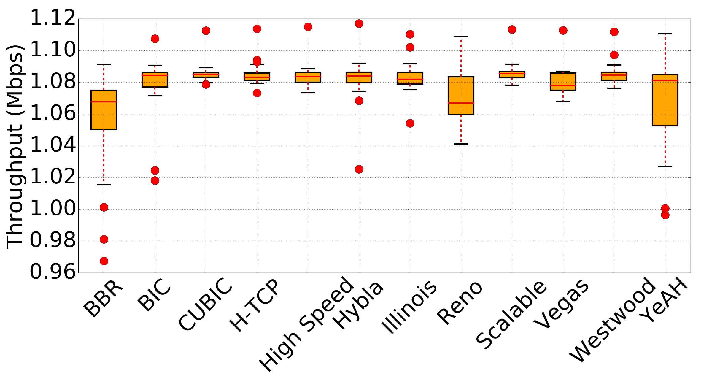
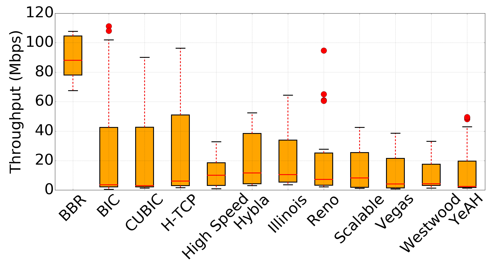

# Extensive Evaluation of TCP Congestion Control Algorithms under Varied Network Environments

## 1. 绪论

### 1.1 论文研究背景

TCP（Transmission Control Protocol）协议是一种有连接的运输层协议，旨在为TCP/IP协议栈中的上层提供稳定、有序和不重复的数据传送服务。为了实现这种稳定可靠的数据传输服务，需要引入用来决定应该如何发送数据包的TCP拥塞控制算法（Congestion Control Algorithm，CCA）[1]，以便在及早发现网络中的拥塞并采取针对性的措施以保证TCP能够高效地传输数据。基于以上目的，学界和工业界的研究人员在过去几十年中创造出了多种TCP拥塞控制算法，以解决某一特定的网络环境下的拥塞问题。

显然，每一种拥塞控制算法均有其局限性与适用的网络环境。但是经过多年的发展，计算机网络所依赖的底层基础电子技术已经取得了巨大的进步，使得网络在带宽和误码率等有了明显改善。**在这种情况下，Reno（New Reno）[2]、Vegas[3]和HighSpeed[4]等实现时间较早，但至今在现存系统中被广泛使用的拥塞控制算法是否能在现有的网络条件下有效地进行拥塞控制，值得我们去探讨。**

同时，除了由技术上的进步所带来的网络物理特性的改变以外，计算机网络层出不穷的应用场景也对现有的拥塞控制算法提出了巨大的挑战。比如，在数据中心网络（Data Center Network，DCN）的内部网络往往处于高带宽、低延迟和低误码率的理想状态；而蜂窝网络（Cellular Network）和无线局域网（Wireless Local Area Network，WLAN）的网络则常常与之相反；常用的广域网（Wide Area Network，WAN）和局域网（Local Area Network）的网络情况则相当多变。**除了使用专用算法的DCN和蜂窝网络以外，网络管理员应该如何在WAN、LAN和WLAN等贴近日常生活的网络类型中根据网络的特点与上层应用的要求在服务端来选择一种合适的拥塞控制算法，也是值得我们深入研究的问题。**

### 1.2 论文主要研究内容

本次研究的主要内容是分别对有线和无线网络环境中的各种拥塞控制算法在不同的应用场景之下进行全面的测试，并分析了各种算法在拥塞控制效果上的差异及其成因，并以此为基础提出了在不同网络场景中选择合适的拥塞控制算法的建议。本文的主要工作可简要描述如下：

* 全面调研了现有的TCP拥塞控制算法及其相关测试研究，学习了这些研究中关于设计实验与部署工具的方法。同时，针对性地在前人工作的基础上引入了符合当前网络环境的实验工具与实验方法。
* 本次研究针对有线和无线两种网络形式，设计了几种具有针对性的测试场景，并对相应场景中常用拥塞控制算法进行了全面的测试以及深入分析。
* 根据本此研究所得到的数据与结论，提出了若干条关于在特定场景下选择合适的TCP拥塞控制算法的建议，并提出了在本次研究中所发现的问题。

### 1.3 论文的创新与贡献

与之前的研究[8, 9, 10, 11, 12, 13]相比，本次研究通过对有线和无线网络中的拥塞控制算法进行了全面的测试与分析，对相关领域做出了以下两条贡献：

* 提出了几条在不同网络环境下选择合适的拥塞控制算法的参考意见。
* 在基于现代网络设备的有线和无线网络场景中均取得了详实的实验资料，为以后的改进提供了依据。

### 1.4 论文各章内容安排

本文共分为六章，除首章绪论外，其余章节的主要内容简介如下：

+ 第二章主要介绍了TCP拥塞控制的基本概念、所涉及到的算法和相关研究。
+ 第三章主要介绍本次实验的具体方案，包括测试的标准、网络拓扑、测试工具和网络场景等四方面。
+ 第四章主要介绍了在有线网络环境下进行的测试及其结论。
+ 第五章主要介绍了在无线网络环境下进行的测试及其结论。

结论于文末单独成章，对本文的工作进行了总结，并提出了一些仍需要在未来进行深入研究与分析的问题。

### 1.5 术语说明

## 2. 相关研究综述

### 2.1 本章引论

### 2.2 TCP拥塞控制的基本概念

#### 2.2.1 拥塞的来源与拥塞窗口

由于TCP采用了有连接的方式来传输数据，所以每一条连接以及其上的数据就可以抽象地描述为一条TCP流。在实际的传输过程中，一条TCP流中的数据，从源节点到目的节点往往需要经过多次转发。而在这个转发的过程中，由于转发节点（瓶颈节点）的处理能力有限，需要把收到的数据进行缓存后，在处理能力许可的情况下再行处理。那么，在这个等待处理的过程中，流中的数据包将不可避免地在此处产生拥塞。如果数据的发送方没有采用拥塞避免机制，则仍会在网络出现拥塞之后向网络中注入大量数据包，进一步加重瓶颈节点的拥塞情况，并最终导致网络死锁。而在启用了拥塞控制算法的TCP链接中，发送方将会维护一个类似于滑动窗口的拥塞窗口（Congestion Window，cwnd），用来感知网络中的拥塞并限制已发送但未确认的数据包的数量，以保证网络不会处于过于拥塞的状况。

#### 2.2.2 慢开始、拥塞避免、快重传和快恢复

慢开始（Slow start）、拥塞避免（Congestion Avoidance）、快重传（Fast Retransmit）和快恢复（Fast Recovery）是TCP进行拥塞控制的重要概念，在RFC 5681[21]中有详细描述。

慢开始指的是发送方以一个较小的拥塞窗口大小，比如1至10个MSS（Maximum Segment Size，最大分段大小）来发送数据并在每收到一个数据包的确认后使cwnd的值翻倍，以探测网络所能承载的最大数据量，并避免在未知网络具体情况的情况下就发送大量数据而使网络出现拥塞，直到发送的数据超过了接收方的接收窗口（Receiver Window，rwnd）大小、超过了ssthresh的限制等异常情况，又或者网络中出现了拥塞。可简要描述如下：

* 在cwnd增长至与ssthresh相当时又或者超出了接收方的rwnd，就将用线性增长的方式来使得cwnd得以继续缓慢地增长。具体地就是在每经过RTT（Round Trip Time，往返时延）的时间就使cwnd增加一个MSS的大小。
* 若发送方察觉到网络中出现了拥塞，就将进入拥塞避免状态，并调用系统中指定的拥塞控制算法以降低网络中的数据包的数量，其具体操作由拥塞控制算法确定。而此种情况下的拥塞控制效果也是本次研究的重点。

在TCP的具体实现中，当接收方收到了一个失序抵达的数据包时，应当立刻向发送方回复一个重复的确认，以通知发送方此数据包未按预定顺序抵达，并提示应当收到的数据包的编号。通常而言，造成数据包失序抵达的原因可以是网络出现了拥塞、网络调换了数据包的顺序[22]又或者是网络复制了一个数据包等原因。对于发送方而言，收到重复的确认就可以认为是网络出现了拥塞。除了重复的确认以为，重传计时器超时也被认为是由于网络发生了拥塞而导致的。

而为了加快从拥塞中回复的流程，发送方往往采用“快恢复”机制来发送丢失的数据包。即发送方在通过三重ACK来确认一个数据包的丢失之后，立刻重传此数据包，而非等候重传计时器超时。

通常而言，慢启动机制将缓慢地增加cwnd的值以探测网络的最大负载。而在丢包重传的情况下，未丢失数据包之前的网络负责则是网络可以接受的。如果直接使用慢启动机制来是的cwnd减半则不利于发送方快速恢复到丢包之前的状态。所以，在快恢复机制把丢失的数据包重传之后，称为“快恢复”的机制将接替“快重传”机制的控制权直到下一个不重复的ACK抵达接收方。与慢开始（即拥塞窗口cwnd现在不设置为1）的不同之处是，cwnd值被设置为ssthresh减半后的数值，然后开始执行拥塞避免算法（即所谓的加法增大），使得拥塞窗口缓慢地线性增大。

### 2.3 本文所涉及到的TCP拥塞算法

#### 2.3.1 Vegas 1995

Vegas[3]是一个基于延迟的拥塞控制算法，即通过连续计算最新RTT值与基准RTT值的相对大小来确定合适的数据发送速率。当最新的RTT值与基准RTT值有较大幅度的增加时，就认为网络中将要出现拥塞，己方需要降低数据发送速率以缓解网络拥塞。当最新RTT值与基准RTT值相对下降时，认为网络空闲，己方需要增加数据发送速率。

#### 2.3.2 New Reno 1999

New Reno[2]是Reno[23]的最新改进版，主要针对后者所引入的快恢复算法作出了改进。在Reno的控制下，发送方会在重传计时器超时或者收到三个重复的确认的情况下重传一个数据包。这样的话，如果在多个数据包同时丢失，Reno就会频繁调用快重传算法[24]，使得拥塞窗口迅速减小[25]。New Reno算法则会在把所有从进入快恢复阶段开始的所有未被确认的数据包都被确认之后才会退出快恢复阶段，从而避免了以上问题。

#### 2.3.3 Westwood 2002

Westwood[26]是一种基于延迟和丢包的拥塞控制算法，其使用RTT以及此时间段内被发送的数据包大小作为计算可用最大带宽的依据。当数据包丢失时，拥塞窗口和慢启动门限会被设置得贴近当前带宽的估计值。这样就可以减小快恢复阶段所需要的时间。由于无线网络中常常丢包的现象，结合此算法恢复时间较短的特点，故此算法常用在无线网络中。

#### 2.3.4 HighSpeed 2003

HighSpeed[27]是一个基于丢包的拥塞控制算法，主要针对具有高BDP（Bandwidth Delay Product，带宽延迟积）特性的网络进行了优化。它的特点是使用加法因子和乘法因子以及当前的丢包率等来作为参数，以控制AIMD过程中拥塞窗口的大小。

#### 2.3.5 Scalable 2003

Scalable[28]是Reno经过简单修改之后的结果。在Scalable算法中，加法因子被修改为0.01而乘法因子被修改为0.875，以优化该算法在高速广域网中传输大量数据的性能表现。

#### 2.3.6 Veno 2003

Veno[35]是一种对无线网络中随机出现的丢包作出了针对性优化的拥塞控制算法同时考虑了延迟与丢包两种因素，并能够区分无线网络中经常出现的随机丢包现象和真正的网络拥塞。具体而言，就是使用了与Vegas相类似的算法来预测网络中是否将要出现拥塞；如果预测结果为肯定的，并且之后出现了丢包的现象，那么就认为这次丢包是由于网络拥塞引起的，需要进行拥塞避免操作；否则，认为此次丢包是由于网络随机错误引起的，直接重传此数据包。这样，就可以避免出现无谓的性能损失。

#### 2.3.7 BIC 2004

BIC[29]是一种基于丢包的拥塞控制算法，主要针对在高BDP网络环境下，通过动态计算当前拥塞窗口的大小所对应的最佳发送速率，以充分利用链路带宽并且维持算法之间的相对公平。其核心算法有两个：二次搜索增窗算法和加法增窗算法。其中，二次搜索增窗算法主要负责在拥塞窗口较小时在不同的流之间维持较好的公平性；加法增窗算法主要负责在拥塞窗口较大时

#### 2.3.8 H-TCP 2004

H-TCP[34]是一种针对高速长距离网络传输以及兼容低速传统网络进行了针对性优化，并同时考虑丢包和延迟的拥塞控制算法。它以当前与上次拥塞事件之间的时间差来作为加法增窗函数的重要参数。当时间差小于某值时，加法增窗函数处于低速模式，其各项设定较为保守，以提高对低速网络的兼容性；当时间差大于某值时，它采用是检查作为加法增窗函数的参数，并激进地增大窗口大小，以提高在高速网络中的表现。

#### 2.3.9 Hybla 2004

Hybla[33]是一种针对高错误率和高延迟进行了针对性优化的拥塞控制算法。主要的特点在于，它使用了归一化之后的RTT以移除实时RTT对拥塞窗口的影响。

#### 2.3.10 YeAH 2007

YeAH[31]是一种同时考虑延迟和丢包的拥塞控制算法。它保留了Vegas用来探测网络状况的算法，并引入了快慢两种工作模式：快模式主要用于激进地提高窗口的大小以获取较高的带宽利用率；慢模式用来维持与其他拥塞控制算法的相对公平性。

#### 2.3.11 CUBIC 2008

CUBIC[30]是一种基于丢包的拥塞控制算法，针对BIC算法中较为激进的窗口调整策略和糟糕的算法间公平性作出了较大的改进。现已作为Linux 2.6以后的默认拥塞控制算法。简而言之，CUBIC使用了以距离上次丢包时间为主要参数的三次函数来动态地确定当前拥塞窗口的大小，以维持较好的可扩展性和稳定性。

#### 2.3.12 Illinois 2008

Illinois[32]是一种综合考虑了丢包和延迟的拥塞控制算法，针对高速长距离传输做了针对性优化。此算法是使用了丢包作为决定拥塞窗口增减的依据，并使用排队延迟（Queue Delay）来计算应该把拥塞窗口增加或者减小多少。

#### 2.3.13 BBR 2016

BBR[1]是一中基于BDP的拥塞控制算法，有效地解决了网络瓶颈处缓存过满的问题。该算法主要通过测量两个链路参数：往返传播时间（Rountd Trip Prapagation Time）和瓶颈带宽（Bottleneck Bandwidth），来保证发送方始终能以最大速度发送数据。

| 算法名称  | 发表时间 | 目标网络环境           | 反馈类型           | 主要特点                                       |
| --------- | -------- | ---------------------- | ------------------ | ---------------------------------------------- |
| Vegas     | 1995     | 有线低速延迟网络       | 基于延迟           | 提前预测拥塞的出现并降低自身发送速率           |
| NewReno   | 1999     | 有线低速延迟网络       | 基于丢包           | 修改了标准的快恢复算法                         |
| Westwood  | 2002     | 具有高错误率的无线网络 | 基于丢包           | 每一个RTT均计算可用带宽                        |
| HighSpeed | 2003     | 高BDP网络              | 基于丢包           | 针对大拥塞窗口做出了针对性优化                 |
| Scalable  | 2003     | 高速WAN                | 基于丢包           | 针对高速网络做出了针对性优化                   |
| Veno      | 2003     | 具有高错误率的无线网络 | 同时考虑延迟和丢包 | 通过预测与验证区分随机错误与网络拥塞导致的丢包 |
| BIC       | 2004     | 高BDP网络              | 基于丢包           | 通过二次搜索算法来确定拥塞窗口大小             |
| H-TCP     | 2004     | 高BDP网络              | 同时考虑延迟和丢包 | 通过使用快慢两种模式来增加对低速网络的兼容性   |
| Hybla     | 2004     | 高错误率和高延迟网络   | 基于延迟           | 使用归一化的RTT以移除异常RTT的影响             |
| YeAH      | 2007     | 高BDP网络              | 同时考虑延迟和丢包 | 通过使用快慢两种模式来增加对低速网络的兼容性   |
| CUBIC     | 2008     | 高BDP网络              | 基于丢包           | 使用三次函数来确定拥塞窗口大小                 |
| Illinois  | 2008     | 高BDP网络              | 基于延迟           | 综合考虑了丢包与排队延迟以确定拥塞窗口大小     |
| BBR       | 2016     | 高BDP网络              | 基于BDP            | 通过不停估计网络最大瓶颈带宽来确定拥塞窗口大小 |

### 2.4 TCP拥塞算法性能测试相关研究

由于对TCP拥塞控制算法在不同网络环境下进行测试以检查其有效性十分重要，学界和工业界的研究人员均对此问题进行了大量研究。

Mario Hock等人在其研究中[8]对新提出并已经得到广泛应用的拥塞控制算法BBR进行了独立而深入的测试与分析。
- 由于他们已经对包含BBR在内的常用的拥塞控制算法的底层(带宽Throughput、排队延迟Queuing delay、丢包率Packet loss和公平性Fairness)进行了深入分析，故本文便从上层应用的角度来分析拥塞控制算法的有效性。同时增加此研究中没有的与RTT相关的研究。
- Mario Hock等人的研究主要针对的是1Gbps和10Gbps的高速网络，并不适用于常见的LAN、WAN和WLAN当中，故本次研究采用了常用的1Mbps至100Mbps的网络带宽设定。在BBR的原始文献[1]中进行了5Mbps到5Gbps的实验，但是他们的实验没有记录有关重传的数据。本次实验中所获得的有关BBR重传的数据将填补这方面的空白。

Kevin Ong等人在其研究中[9]中对无线网络中的常用拥塞控制算法在进行了详细的测试。
- 然而他们的文章中只有带宽和延迟两个测试项目，并不能完全反应算法的真实性能。本次研究增加了对重传的考察。
- 另外，本次研究中增加了了Kevin Ong等人尚未进行测试的5GHz频段，以考察2.4GHz和5GHz两种具有完全不同的物理特性的传输方式对拥塞控制的影响。
- 本次研究主要针对大文件长时间传输。其研究中主要用以进行文件传输测试的文件大小为10MB以内的小文件。在高速无线网络中，这种大小的文件并不能持续传输足够长的时间，给拥塞控制算法提供足够以考察其真实性能表现。

Thomas Lukaseder等人在其研究中[10]使用NetFPGA给测试网络引入可控的丢包率，并研究了New Reno、Scalable、HighSpeed、H-TCP、BIC和CUBIC等算法在不同丢包率下的性能差异，并分析差异的的成因。然而，作者的实验是基于国有的教育网，其结论同样并不适用与因特网。

论文发表时间较早的有Callegari等人的研究[12]，对Linux 2.6内核所包含的13种拥塞控制算法均进行了测试；以及LA Grieco等人所做的研究[13]，其中引入了模拟测试和场景测试的概念。他们的研究方案与结论对我进行本次研究给予了重要的参考。

## 3. 测试方案

### 3.1 性能标准

#### 3.1.1 RTT

从发送数据包开始到收到其确认，所得此数据包的RTT由三个部分所组成：发送方向链路的传输延迟$Prop_{send}$、确认方向链路的传输延迟$Prop_{recv}$、以及链路上各节点处理数据包的时间$\eta_{t}$。为了简便起见，在本次研究中将采用由iperf3软件每隔一段固定时间所报告的此时间段内发送的所有数据包的平均RTT，来作为后续分析的基础。

$$
RTT={Prop_{send}+Prop_{recv}+\eta_{t}}
$$

#### 3.1.2 带宽

带宽是在单位时间内传输的数据量$\Delta{D}$与时间$\Delta{T}$的比值。由于在任意小固定的时间单位内，总会有部分数据仍在网络中传输，发送方发出的数据与接收方收到的数据不一定会相等。故为了价简便期间，本次研究中将采用由iperf3软件报告的，由发送方在单位时间内发送的数据量除以单位时间长度所得的此时间单位内的平均带宽。

$$
Throughput=\frac{\Delta{D_{send}}}{\Delta{T}}
$$

#### 3.1.3 算法间公平性

在本次研究中，我们将会使用公平性指数（Jain`s Fairness Index）[39]来量化表述两条TCP流之间的相对公平性。以下为公平性指数的计算公式。在本次研究中，公平性测试是在两条同方向的数据流之间进行的，故此公式中的n=2。

$$
J(x_1, x_2, ..., x_n)=\frac{(\sum\limits_{i=1}^nx_i)^2}{n\sum\limits_{i=1}^n{x_i}^2}
$$

上图是假定瓶颈带宽总是被两条TCP流完全占据，其中一条TCP流所得带宽与公平指数之间的关系图。显然，指数是非线性增长的。为了方便描述两条TCP流之间的相对公平性，我们定义如下几种公平性状态，以便形象地描述TCP流所占的带宽份额：

- 指数值低于0.8时，任一条TCP流占据的带宽少于25%。此时定义为“不公平”状态。
- 指数值为0.8至0.9时，任一条TCP数据流至少占据25%至35%的带宽。此时定义为“一般公平”状态。
- 指数值为0.9至1.0时，任一条TCP数据流至少占据35%至50%的带宽。此时定义为“相对公平”状态。

#### 3.1.4 重传计数

TCP链路的重传包括由链路随机错误产生的重传和因网络拥塞而丢失数据包所产生的重传两种。在本次研究中，由于任一段链路两端中的拥塞控制算法均无法得知需要重传的数据包因何种原因丢失，故将直接采用由iperf3软件报告的单位时间内重传数。

### 3.2 测试工具

#### 3.2.1 iperf3

iperf3[36]，由ESnet开发，是一个用来测试IP网络中TCP、UDP和SCTP协议下网络带宽的开源测试工具。每一个测试，iperf3都会提供相应的RTT、带宽和重传计数等信息，供用户判断当前网络状态。

#### 3.2.2 Mininet

Mininet[37]是一种可以创建由一些虚拟的终端节点、交换机、路由器连接而成的网络的仿真器，它采用轻量级的虚拟化技术使得系统可以和真实网络相媲美。在这个虚拟网络中，用户可以像使用真实的电脑一样进行操作：可以使用SSH登录、启动应用程序、向以太网端口发送数据包、观察数据包会被交换机和路由器接收并处理的过程等。有了这个网络，就可以灵活地为网络添加新的功能并进行相关测试，然后轻松部署到真实的硬件环境中。

#### 3.2.3 curl

curl[38]是利用URL语法在命令行方式下工作的开源文件传输工具，支持HTTP、FTP以及SCP等多种协议，能够方便地在不同的网络环境中使用。

### 3.3 网络拓扑

#### 3.3.1 有线网络部分

有线网络部分的测试安排了LAN、中国深圳到中国广州的WAN 1和美国Portland到中国北京的WAN 2等三条线路。各线路的带宽限制如下：

| 线路名称 | 数据流起点           | 数据流终点         | 瓶颈带宽限制                                                                                                                                           |
| -------- | -------------------- | ------------------ | ------------------------------------------------------------------------------------------------------------------------------------------------------ |
| LAN      | 暨南大学南海楼实验室 | 暨南大学数据中心   | 带宽由实验室100Mbps交换机限制                                                                                                                          |
| WAN 1    | 中国深圳阿里云机房   | 暨南大学数据中心   | 由阿里云方面的共享网关限制为1Mbps，实际带宽限制不固定。但在实际测试中几乎所有样本点均落在1.5Mbps以内，突发传输速率可达3.5Mbps，最高平均速度约为1.3Mbps |
| WAN 2    | 美国Portland         | 中国北京阿里云机房 | 由阿里云方面的共享网关限制为100Mbps，实际带宽限制不固定。                                                                                              |

#### 3.3.2 无线网络部分

无线网络部分的测试安排在下图的无线网络中完成，其中包含一台TP-LINK TL-WDR6500无线路由器、一台作为服务器的台式机和两台作为客户端的笔记本电脑。在这个无线网络中，每一台PC机均使用无线网卡与无线路由器相连。根据实验的需要，三台PC机将同时使用2.4GHz或者5GHz连接路由器（例如，在2.4GHz的实验中，所有PC机都将使用2.4GHz频段连接无线路由器；其他设置由网卡与路由器协商确定）。

由于影响无线网络性能的因素甚多，本次实验挑选了频段和发射功率两个因素（即在2.4GHz和5GHz频段中均进行20mw、15mw、10mw和5mw四种发射功率的测试）。

### 3.4 测试类型

#### 3.4.1 基准性能测试

在对每一个场景进行全面测试之前，都会通过iperf3来对目标场景进行长时间的连续测试，以求全面地了解在该场景下用来作为基准的CUBIC（有线网络）算法和Westwood（无线网络）在RTT、带宽和重传计数等三个方面的性能表现。在基准测试中获得的RTT、带宽和重传计数等，其平均值将会作为基准线出现在之后的测试的结果图及其分析中。采样周期为1秒。无线网络的基准测试将只涉及主机A和B。在两类网络上的详细设定上的差异如下表：

| 项目             | 有线网络 | 无线网络 |
| ---------------- | -------- | -------- |
| 基准拥塞控制算法 | CUBIC    | Westwood |
| 测试时长         | 24小时   | 1小时    |

#### 3.4.2 TCP性能测试

在基准测试之后，将使用iperf3对所有场景中的TCP拥塞控制算法进行详细测试。主要的测试内容是在该场景下使用特定TCP拥塞控制算法来控制iperf3数据流，并以1秒为单位通过iperf3来记录该数据流的RTT和带宽等各项参数。在此测试过程中，将引入其他TCP流，以考察该TCP拥塞控制算法在有竞争的情况下的性能表现。除了发送测试数据的主机之外，其余主机的各项设定固定。在两类网络上的详细设定上的差异如下表：

| 项目          | 有线网络                                                         | 无线网络                                                                          |
| ------------- | ---------------------------------------------------------------- | --------------------------------------------------------------------------------- |
| 其他TCP流来源 | 不可控的公用网络中的其他数据流，其数据不能被记录                 | 可控的使用iperf3引入的Westwood数据流，其数据会被记录                              |
| 测试时长      | 共两组，每组测试一共进行六轮，每个算法在每一轮测试中均测试10分钟 | 共一组，每个频段的每一个发射功率均进行3轮测试，每个算法在每一轮测试中均测试10分钟 |

#### 3.4.3 文件传输测试

在完成TCP性能测试之后，将使用curl进行文件下载测试。在此类测试之中，将在测试主机上使用Apache 2建立服务器，并且使用其他主机下载服务器中的文件。在有线网络和无线网络中将下载不同大小的文件，以保证每次下载操作的所需时间约为一分钟。下载操作将重复进行，然后计算总平均下载速度。。由于有线网络中不可控因素较多，故测试次数多于无线网络。在两类网络上的详细设定上的差异如下表：

| 项目      | 有线网络               | 无线网络                                             |
| --------- | ---------------------- | ---------------------------------------------------- |
| 文件大小  | 5M                     | 64M                                                  |
| 重复次数  | 50次                   | 20次                                                 |
| 其他TCP流 | 不可控的公用网络数据流 | 另外一台使用Westwood算法的PC进行curl下载操作的数据流 |

#### 3.4.4 公平性测试

在完成应用测试之后，由于有线网络环境较为复杂，无法保证网络中仅有测试数据流和对照数据流，故将在Mininet虚拟网络中按照基准测试中获得的网络特性参数（包括RTT、带宽和丢包率等）创建一个具有类似参数的虚拟网络。网络拓扑为哑铃型拓扑以增强冲突与简化网络。拓扑中的两台发送端主机通过两台交换机组成的单瓶颈链路向处于瓶颈另一端的接收主机分别使用iperf3发送数据。另外，由于本次研究所用的无线网络拓扑简单可控，故无线网络部分的公平性测试将直接在真实网络拓扑中进行。相关设置上的差异如下表：

| 项目                    | 有线网络                                | 无线网络                                    |
| ----------------------- | --------------------------------------- | ------------------------------------------- |
| 对照组的TCP拥塞控制算法 | CUBIC、Reno和与测试组相同的拥塞控制算法 | CUBIC，Westwood和与测试组相同的拥塞控制算法 |
| 测试时长与次数          | 每个算法进行3次实验，每次5分钟          | 每个算法进行1次实验，每次15分钟             |

## 4. 基于有线网络的性能测试结果与分析

### 4.1 基准性能测试

#### 4.1.1 LAN

对于LAN，其基准性能测试结果如下表：

| 测试项目                | 最大值 | 最小值 | 平均值 | 中位数 | 方差  |
| ----------------------- | ------ | ------ | ------ | ------ | ----- |
| RTT                     | 176.89 | 2.57   | 9.68   | 8.14   | 48.75 |
| 带宽                    | 105.30 | 0.00   | 88.90  | 90.00  | 52.93 |
| 重传计数（单位：包/秒） | 331.00 | 0.00   | 0.00   | 0.06   | 3.31  |

#### 4.1.2 WAN 1

对于WAN 1，其基准性能测试结果如下表：

| 测试项目                | 最大值 | 最小值 | 平均值 | 中位数 | 方差  |
| ----------------------- | ------ | ------ | ------ | ------ | ----- |
| RTT                     | 247.50 | 29.27  | 31.39  | 30.93  | 28.63 |
| 带宽                    | 3.50   | 0.00   | 1.33   | 1.03   | 0.11  |
| 重传计数（单位：包/秒） | 130.00 | 0.00   | 9.56   | 9.00   | 3.13  |

#### 4.1.3 WAN 2

对于WAN 2，其基准性能测试结果如下表：

| 测试项目                | 最大值 | 最小值 | 平均值 | 中位数 | 方差    |
| ----------------------- | ------ | ------ | ------ | ------ | ------- |
| RTT                     | 927.26 | 230.08 | 259.96 | 236.56 | 3385.34 |
| 带宽                    | 100.02 | 0.00   | 40.59  | 40.00  | 323.41  |
| 重传计数（单位：包/秒） | 748.00 | 0.00   | 10.92  | 0.00   | 3243.44 |

#### 4.1.4 基准测试小结

在所有场景的基准测试中，除了WAN 2外，作为性能基准的CUBIC算法均能有效地控制链路的RTT、带宽与重传三项重要指标。但是在具有跨国链路的WAN 2中，CUBIC的性能相当不佳，其平均带宽仅有理论值的40%。文献[1]中也获得了类似的测试结果。

### 4.2 TCP性能测试

#### 4.2.1 LAN

| 算法名称  | 平均RTT | 算法名称  | 平均带宽 | 算法，按平均重传数从小到大排序 | 平均重传数（单位：包每秒） |
| --------- | ------- | --------- | -------- | ------------------------------ | -------------------------- |
| Vegas     | 1.89    | Scalable  | 89.18    | Vegas                          | 0.002                      |
| BBR       | 4.10    | H-TCP     | 89.13    | YeAH                           | 0.004                      |
| YeAH      | 6.56    | Hybla     | 89.10    | H-TCP                          | 0.004                      |
| Hybla     | 7.80    | BIC       | 89.07    | HighSpeed                      | 0.004                      |
| NewReno   | 8.18    | CUBIC     | 88.99    | BBR                            | 0.004                      |
| Illinois  | 8.79    | Illinois  | 88.96    | Scalable                       | 0.005                      |
| BIC       | 8.93    | HighSpeed | 88.93    | Hybla                          | 0.011                      |
| CUBIC     | 9.26    | NewReno   | 88.90    | Illinois                       | 0.012                      |
| H-TCP     | 9.39    | YeAH      | 88.89    | CUBIC                          | 0.022                      |
| HighSpeed | 9.70    | BBR       | 87.94    | NewReno                        | 0.022                      |
| Scalable  | 10.39   | Vegas     | 67.90    | BIC                            | 0.046                      |

#### 4.2.2 WAN 1

| 算法名称  | 平均RTT | 算法名称  | 平均带宽 | 算法，按平均重传数从小到大排序 | 平均重传数（单位：包每秒） |
| --------- | ------- | --------- | -------- | ------------------------------ | -------------------------- |
| Scalable  | 30.25   | H-TCP     | 1.02     | H-TCP                          | 9.19                       |
| Illinois  | 30.42   | NewReno   | 1.02     | CUBIC                          | 9.69                       |
| HighSpeed | 30.87   | Hybla     | 1.02     | Vegas                          | 12.94                      |
| YeAH      | 30.87   | HighSpeed | 1.02     | NewReno                        | 14.35                      |
| Hybla     | 30.93   | Vegas     | 1.02     | BIC                            | 14.41                      |
| BIC       | 31.09   | Illinois  | 1.02     | HighSpeed                      | 15.18                      |
| NewReno   | 31.20   | BIC       | 1.02     | Illinois                       | 18.35                      |
| BBR       | 31.23   | CUBIC     | 1.02     | Hybla                          | 18.81                      |
| CUBIC     | 31.42   | Scalable  | 1.02     | YeAH                           | 43.12                      |
| H-TCP     | 31.68   | BBR       | 1.02     | Scalable                       | 44.34                      |
| Vegas     | 31.79   | YeAH      | 1.02     | BBR                            | 90.71                      |

#### 4.2.2 WAN 2

| 算法名称  | 平均RTT | 算法名称  | 平均带宽 | 算法，按平均重传数从小到大排序 | 平均重传数（单位：包每秒） |
| --------- | ------- | --------- | -------- | ------------------------------ | -------------------------- |
| YeAH      | 244.26  | Illinois  | 56.19    | Vegas                          | 0.72                       |
| Illinois  | 244.62  | Hybla     | 52.68    | NewReno                        | 0.94                       |
| H-TCP     | 245.72  | YeAH      | 52.19    | Hybla                          | 3.79                       |
| NewReno   | 246.52  | Scalable  | 49.01    | Scalable                       | 9.91                       |
| Scalable  | 246.78  | BIC       | 46.95    | CUBIC                          | 13.69                      |
| Hybla     | 247.09  | H-TCP     | 45.56    | BIC                            | 14.81                      |
| Vegas     | 247.61  | BBR       | 44.88    | Illinois                       | 20.66                      |
| BBR       | 247.93  | CUBIC     | 43.10    | HighSpeed                      | 27.53                      |
| CUBIC     | 248.40  | NewReno   | 37.16    | H-TCP                          | 27.64                      |
| BIC       | 248.93  | HighSpeed | 36.92    | YeAH                           | 31.45                      |
| HighSpeed | 612.90  | Vegas     | 29.00    | BBR                            | 726.05                     |

#### 4.2.3 TCP性能测试小结

在基于LAN的实验当中，除了以控制RTT为目标的Vegas算法之外，其余算法在控制带宽上的表现相差不大。在此场景中，Vegas的设计理念：“预测拥塞的发生，并提前降低自身的发送速率以避免拥塞的发生”，使得Vegas几乎不可能在拥塞激烈的LAN环境中获取相对公平的带宽份额。但是，这种设计理念使得它控制的TCP流能够获得最佳的RTT。故对RTT有严格要求但对带宽无要求的应用可以使用Vegas控制自身的TCP数据流。

在基于WAN 1的实验当中，所有受测算法在RTT和带宽上的表现均无较大差别。但是，在平均重传数目上，最多的BBR算法大约是最少的H-TCP算法的十倍。

在基于WAN 2的实验当中，除了HighSpeed算法外，其余受测算法在RTT上并无较大差别。在带宽的控制上，除了Vegas外，其余算法均有接近或者超过CUBIC的表现。但是在重传上，与在WAN 1中的表现相类似，BBR也重传了大量数据包。

### 4.3 文件传输测试

#### 4.3.1 LAN

#### 4.3.2 WAN 1

#### 4.3.3 WAN 2

#### 4.3.2 文件传输测试小结

在基于LAN的测试当中，所有算法均能很好地利用现有的带宽资源。其中，H-TCP、Illinois和Vegas三种算法的结果在不同的测试之间差距较大，性能表现不如其他算法稳定。

在基于WAN 1的测试当中，同样地，所有算法均能很好地利用现有的带宽资源。其中，BBR、NewReno和YeAH三种算法的结果在不同的测试之间差距较大，性能不如其他算法稳定。

而在基于WAN 2的测试当中，与其他算法相比，BBR算法具有明显的优势。在文献[1]中进行的CUBIC算法与BBR算法在跨国链路中的对比研究取得了相似的结果。

### 4.4 算法间公平性测试

#### 4.4.1 LAN

#### 4.4.2 WAN 1

#### 4.4.3 WAN 2

#### 4.4.4 公平性测试小结

在面对Reno流时，LAN中只有Scalable算法和BIC算法的公平指数达到了0.9，即至少获得可用带宽的30%，处于较为公平的状态。而在WAN 1和WAN 2中，无一达到了这个要求。

在面对CUBIC流时，LAN中的算法无一达到要求。当测试场景为WAN 1时，Scalable算法、BIC算法、HighSpeed算法、Hybla算法以及Illinois算法的公平指数均超过了0.95，即至少获得可用带宽的40%，处于相对公平的状态。在WAN 2中，仅有BBR算法Hybla算法的公平指数超过了0.9。值得一提的是，BBR算法的公平指数为0.99，表明其在此场景下取得了相当接近与公平的带宽分配。

在面对另外一条由相同拥塞控制算法的TCP流时，LAN中BBR算法、BIC算法和Illinois算法取得了不错的结果；在WAN 1中，则是BBR算法和HighSpeed算法能在竞争中取得较为公平的带宽分配；而在WAN 2中，仅有YeAH算法所获得的带宽分配较为合理。

### 4.5 本章小结

综合本章的所有实验，我们可以归纳出以下结论与发现：

- Linux系统下默认的CUBIC算法不足以在复杂的跨国网络中有效地控制TCP数据流的RTT和带宽。从文件下载测试的结果来看，BBR算法可以对带宽实现较好的控制。
- BBR算法在实验中重传了大量的数据包。它较多的重传是否会在被广泛应用的情况下是否会对网络产生不利影响尚未得到研究。

## 5. 基于无线网络的性能测试结果与分析

### 5.1 基准性能测试

#### 5.1.1 2.4GHz 部分

-   tx-20mw

| 测试项目 | 最大值 | 最小值 | 平均值 | 中位数 | 方差    |
| -------- | ------ | ------ | ------ | ------ | ------- |
| RTT      | 156.45 | 4.05   | 13.28  | 10.96  | 74.30   |
| 带宽     | 167.79 | 0.00   | 77.34  | 73.41  | 1102.40 |
| 重传计数 | 37.00  | 0.00   | 0.14   | 0.00   | 1.07    |
    
-   tx-15mw

| 测试项目 | 最大值 | 最小值 | 平均值 | 中位数 | 方差   |
| -------- | ------ | ------ | ------ | ------ | ------ |
| RTT      | 95.47  | 3.98   | 10.61  | 9.85   | 13.82  |
| 带宽     | 167.80 | 0.00   | 110.96 | 115.35 | 657.79 |
| 重传计数 | 41.00  | 0.00   | 0.07   | 0.00   | 0.91   |

-   tx-10mw

| 测试项目 | 最大值 | 最小值 | 平均值 | 中位数 | 方差   |
| -------- | ------ | ------ | ------ | ------ | ------ |
| RTT      | 46.94  | 4.00   | 9.64   | 9.14   | 5.90   |
| 带宽     | 193.85 | 10.48  | 124.71 | 125.84 | 406.34 |
| 重传计数 | 42.00  | 0.00   | 0.06   | 0.00   | 0.80   |

-   tx-5mw

| 测试项目 | 最大值 | 最小值 | 平均值 | 中位数 | 方差   |
| -------- | ------ | ------ | ------ | ------ | ------ |
| RTT      | 102.64 | 4.38   | 9.47   | 9.08   | 7.76   |
| 带宽     | 197.48 | 10.48  | 142.91 | 146.80 | 409.56 |
| 重传计数 | 31.00  | 0.00   | 0.06   | 0.00   | 0.88   |

#### 5.1.2 5GHz 部分

- tx-20mw

| 测试项目 | 最大值 | 最小值 | 平均值 | 中位数 | 方差   |
| -------- | ------ | ------ | ------ | ------ | ------ |
| RTT      | 215.85 | 5.07   | 27.56  | 24.84  | 202.66 |
| 带宽     | 144.52 | 10.48  | 95.65  | 104.85 | 266.21 |
| 重传计数 | 44.00  | 0.00   | 0.07   | 0.00   | 1.49   |

- tx-15mw

| 测试项目 | 最大值 | 最小值 | 平均值 | 中位数 | 方差   |
| -------- | ------ | ------ | ------ | ------ | ------ |
| RTT      | 253.02 | 5.70   | 35.76  | 31.03  | 758.74 |
| 带宽     | 130.79 | 10.48  | 98.01  | 94.38  | 149.76 |
| 重传计数 | 33.00  | 0.00   | 0.04   | 0.00   | 0.61   |

- tx-10mw

| 测试项目 | 最大值 | 最小值 | 平均值 | 中位数 | 方差   |
| -------- | ------ | ------ | ------ | ------ | ------ |
| RTT      | 223.29 | 5.23   | 23.70  | 21.60  | 101.58 |
| 带宽     | 111.10 | 10.48  | 88.77  | 94.37  | 164.73 |
| 重传计数 | 48.00  | 0.00   | 0.10   | 0.00   | 2.93   |

- tx-5mw

| 测试项目 | 最大值 | 最小值 | 平均值 | 中位数 | 方差   |
| -------- | ------ | ------ | ------ | ------ | ------ |
| RTT      | 119.01 | 5.08   | 23.98  | 22.37  | 73.47  |
| 带宽     | 107.57 | 10.48  | 90.40  | 94.37  | 191.19 |
| 重传计数 | 29.00  | 0.00   | 0.00   | 0.05   | 0.89   |

#### 5.1.3 基准测试小结

从总体上看，在具有众多设备的2.4GHz频段中，随着发射功率的适当降低，RTT和带宽两项测试的结果均有较为明显的改善。而在5GHz频段中两项参数并没有出现较为明显的变化。结合测试时保存的网络参数状态，可以初步判断为是己方发射功率下降，导致己方信号覆盖范围与其他主机的信号覆盖范围的重叠部分减小，信道内的冲突较少。然后其他主机的发射功率（不受控制，具有动态调整发射功率的能力）也跟随下降以节约能源，并最终导致数据传输质量的上升。而在具有很少设备的5GHz频段中，结合5GHz频段穿透能力差的特点（测试所用主机与路由器之间的距离较近且无绝缘物体隔绝），故己方发射功率的下降所导致主要结果就是RTT和带宽两项数据有一定程度的恶化。

### 5.2 TCP性能测试

#### 5.2.1 2.4GHz

- tx-20mw

  
  
  

说明：以下各数据表均分为左右两部分。左边的是按照平均RTT从小到大排序的结果；右边是按照平均带宽从小到达排序的结果。右侧括号内是对照组的平均带宽，以及实验组与对照组的平均带宽之和与相应组别的基准测试所得的平均带宽之比，用来量化描述这一次实验的链路利用率（假定在独占状态下的基准测试时的链路利用率为100%）。其中，平均RTT的单位为毫秒，平均带宽的单位为Mbps。其他各表与下表相同，不再赘述。

| 算法名称 | 平均RTT | 算法名称 | 平均带宽             |
| -------- | ------- | -------- | -------------------- |
| Veno     | 59.59   | CUBIC    | 22.52(11.49, 43.98%) |
| NewReno  | 61.43   | NewReno  | 10.08(21.58, 40.95%) |
| CUBIC    | 69.42   | Veno     | 7.42(23.93, 40.53%)  |
| BBR      | 73.15   | BBR      | 2.54(27.37, 38.67%)  |

- tx-15mw

| 算法名称 | 平均RTT | 算法名称 | 平均带宽             |
| -------- | ------- | -------- | -------------------- |
| BBR      | 59.41   | CUBIC    | 18.89(12.66, 28.44%) |
| CUBIC    | 60.88   | NewReno  | 8.13(17.44, 23.05%)  |
| Veno     | 87.21   | Veno     | 5.38(20.33, 23.18%)  |
| NewReno  | 106.54  | BBR      | 2.68(21.32, 21.64%)  |

- tx-10mw

| 算法名称 | 平均RTT | 算法名称 | 平均带宽             |
| -------- | ------- | -------- | -------------------- |
| Veno     | 122.21  | CUBIC    | 19.27(13.98, 26.66%) |
| NewReno  | 150.42  | Veno     | 18.32(12.67, 24.85%) |
| BBR      | 153.94  | NewReno  | 15.10(13.64, 23.05%) |
| CUBIC    | 172.10  | BBR      | 1.84(29.95, 25.49%)  |

- tx-5mw

| 算法名称 | 平均RTT | 算法名称 | 平均带宽             |
| -------- | ------- | -------- | -------------------- |
| NewReno  | 77.45   | CUBIC    | 27.83(10.38, 26.74%) |
| CUBIC    | 82.88   | NewReno  | 24.39(12.21, 25.61%) |
| Veno     | 96.95   | Veno     | 16.54(16.74, 23.29%) |
| BBR      | 109.00  | BBR      | 2.00(26.96, 20.27%)  |

#### 5.2.2 5GHz

- tx-20mw

| 算法名称 | 平均RTT | 算法名称 | 平均带宽             |
| -------- | ------- | -------- | -------------------- |
| NewReno  | 91.62   | CUBIC    | 20.44(35.38, 55.66%) |
| BBR      | 103.45  | Veno     | 8.36(51.30, 59.49%)  |
| Veno     | 115.57  | NewReno  | 7.28(48.69, 55.81%)  |
| CUBIC    | 120.53  | BBR      | 3.35(52.77, 55.97%)  |
    
- tx-15mw

| 算法名称 | 平均RTT | 算法名称 | 平均带宽              |
| -------- | ------- | -------- | --------------------- |
| Veno     | 116.20  | CUBIC    | 54.22(32.91, 88.90%)  |
| BBR      | 129.41  | Veno     | 31.19(49.93, 82.76%)) |
| CUBIC    | 144.03  | NewReno  | 19.38(58.66, 79.62%)  |
| NewReno  | 151.96  | BBR      | 5.47(78.99, 86.17%)   |

- tx-10mw

| 算法名称 | 平均RTT | 算法名称 | 平均带宽              |
| -------- | ------- | -------- | --------------------- |
| BBR      | 122.55  | CUBIC    | 52.14(41.59, 105.60%) |
| NewReno  | 129.55  | NewReno  | 24.05(60.63, 95.41%)  |
| CUBIC    | 132.64  | Veno     | 12.80(69.71, 92.95%)  |
| Veno     | 165.64  | BBR      | 4.18(81.75, 96.81%)   |

- tx-5mw

| 算法名称 | 平均RTT | 算法名称 | 平均带宽             |
| -------- | ------- | -------- | -------------------- |
| Veno     | 156.32  | CUBIC    | 56.74(28.98, 94.83%) |
| BBR      | 158.01  | NewReno  | 17.06(58.83, 83.96%) |
| NewReno  | 187.11  | Veno     | 5.64(75.96, 90.28%)  |
| CUBIC    | 201.63  | BBR      | 4.48(77.72, 90.94%)  |

#### 5.2.3 TCP性能测试小结

由于本节所进行的TCP性能测试中加入了由Westwood所控制的竞争数据流，测试组所取得的结果不能与独占状态下的基准测试相比。

### 5.3 文件传输测试

### 5.4 算法间公平性测试

### 5.5 本章小结

## 6. 结论

## 参考文献

1. Cardwell N, Cheng Y, Gunn C S, et al. BBR: Congestion-based congestion control[J]. Queue, 2016, 14(5): 50.
2. Floyd S, Gurtov A, Henderson T. The NewReno modification to TCP's fast recovery algorithm[J]. 2004.
3. Brakmo L S, Peterson L L. TCP Vegas: End to end congestion avoidance on a global Internet[J]. IEEE Journal on selected Areas in communications, 1995, 13(8): 1465-1480.
4. Floyd S. HighSpeed TCP for large congestion windows[J]. 2003.
5. Nguyen T A N, Gangadhar S, Sterbenz J P G. Performance Evaluation of TCP Congestion Control Algorithms in Data Center Networks[C]//Proceedings of the 11th International Conference on Future Internet Technologies. ACM, 2016: 21-28.
6. Gerla M, Sanadidi M Y, Wang R, et al. TCP Westwood: Congestion window control using bandwidth estimation[C]//Global Telecommunications Conference, 2001. GLOBECOM'01. IEEE. IEEE, 2001, 3: 1698-1702.
7. Feknous M, Houdoin T, Le Guyader B, et al. Internet traffic analysis: A case study from two major European operators[C]//Computers and Communication (ISCC), 2014 IEEE Symposium on. IEEE, 2014: 1-7.
8. Hock M, Bless R, Zitterbart M. Experimental evaluation of BBR congestion control[C]//Network Protocols (ICNP), 2017 IEEE 25th International Conference on. IEEE, 2017: 1-10.
9. Ong K, Murray D, McGill T. Large-Sample comparison of TCP congestion control mechanisms over wireless networks[C]//Advanced Information Networking and Applications Workshops (WAINA), 2016 30th International Conference on. IEEE,Brakmo L S, Peterson L L. TCP Vegas: End to end congestion avoidance on a global Internet[J]. IEEE Journal on selected Areas in communications, 1995, 13(8): 1465-1480. 2016: 420-426.
10. Lukaseder T, Bradatsch L, Erb B, et al. A comparison of TCP congestion control algorithms in 10G networks[C]//Local Computer Networks (LCN), 2016 IEEE 41st Conference on. IEEE, 2016: 706-714.
11. Nguyen T A N, Gangadhar S, Sterbenz J P G. Performance Evaluation of TCP Congestion Control Algorithms in Data Center Networks[C]//Proceedings of the 11th International Conference on Future Internet Technologies. ACM, 2016: 21-28.
12. Callegari C, Giordano S, Pagano M, et al. Behavior analysis of TCP Linux variants[J]. Computer Networks, 2012, 56(1): 462-476.
13. Grieco L A, Mascolo S. Performance evaluation and comparison of Westwood+, New Reno, and Vegas TCP congestion control[J]. ACM SIGCOMM Computer Communication Review, 2004, 34(2): 25-38.
14. RFC 793, https://tools.ietf.org/html/rfc793
15. RFC 2001, https://tools.ietf.org/html/rfc2001
16. Jacobson V. Congestion avoidance and control[C]//ACM SIGCOMM computer communication review. ACM, 1988, 18(4): 314-329.
17. Floyd S, Gurtov A, Henderson T. The NewReno modification to TCP's fast recovery algorithm[J]. 2004.
18. Brakmo L S, Peterson L L. TCP Vegas: End to end congestion avoidance on a global Internet[J]. IEEE Journal on selected Areas in communications, 1995, 13(8): 1465-1480.
19. Ha S, Rhee I, Xu L. CUBIC: a new TCP-friendly high-speed TCP variant[J]. ACM SIGOPS operating systems review, 2008, 42(5): 64-74.
20. Xu L, Harfoush K, Rhee I. Binary increase congestion control (BIC) for fast long-distance networks[C]//INFOCOM 2004. Twenty-third AnnualJoint Conference of the IEEE Computer and Communications Societies. IEEE, 2004, 4: 2514-2524.
21. RFC 5681, https://tools.ietf.org/html/rfc5681
22. Paxson V. End-to-end Internet packet dynamics[C]//ACM SIGCOMM Computer Communication Review. ACM, 1997, 27(4): 139-152.
23. Fall K, Floyd S. Simulation-based comparisons of Tahoe, Reno and SACK TCP[J]. ACM SIGCOMM Computer Communication Review, 1996, 26(3): 5-21.
24. Hoe J C. Start-up dynamics of TCP's congestion control and avoidance schemes[D]. Massachusetts Institute of Technology, 1995.
25. Floyd S. TCP and successive fast retransmits[R]. Technical report, October 1994. ftp://ftp. ee. lbl. gov/papers/fastretrans. ps, 1995.
26. Gerla M, Sanadidi M Y, Wang R, et al. TCP Westwood: Congestion window control using bandwidth estimation[C]//Global Telecommunications Conference, 2001. GLOBECOM'01. IEEE. IEEE, 2001, 3: 1698-1702.
27. RFC 3649, https://buildbot.tools.ietf.org/html/rfc3649
28. Kelly T. Scalable TCP: Improving performance in highspeed wide area networks[J]. ACM SIGCOMM computer communication Review, 2003, 33(2): 83-91.
29. Xu L, Harfoush K, Rhee I. Binary increase congestion control (BIC) for fast long-distance networks[C]//INFOCOM 2004. Twenty-third AnnualJoint Conference of the IEEE Computer and Communications Societies. IEEE, 2004, 4: 2514-2524.
30. Ha S, Rhee I, Xu L. CUBIC: a new TCP-friendly high-speed TCP variant[J]. ACM SIGOPS operating systems review, 2008, 42(5): 64-74.
31. Baiocchi A, Castellani A P, Vacirca F. YeAH-TCP: yet another highspeed TCP[C]//Proc. PFLDnet. 2007, 7: 37-42.
32. Liu S, Başar T, Srikant R. TCP-Illinois: A loss-and delay-based congestion control algorithm for high-speed networks[J]. Performance Evaluation, 2008, 65(6-7): 417-440.
33. Caini C, Firrincieli R. TCP Hybla: a TCP enhancement for heterogeneous networks[J]. International journal of satellite communications and networking, 2004, 22(5): 547-566.
34. Leith D, Shorten R. H-TCP: TCP for high-speed and long-distance networks[C]//Proceedings of PFLDnet. 2004, 2004.
35. Fu C P, Liew S C. TCP Veno: TCP enhancement for transmission over wireless access networks[J]. IEEE Journal on selected areas in communications, 2003, 21(2): 216-228.
36. esnet/iperf, https://github.com/esnet/iperf
37. Mininet Team, http://mininet.org/
38. curl, https://github.com/curl/curl
39. Jain R, Chiu D M, Hawe W R. A quantitative measure of fairness and discrimination for resource allocation in shared computer system[M]. Hudson, MA: Eastern Research Laboratory, Digital Equipment Corporation, 1984.
